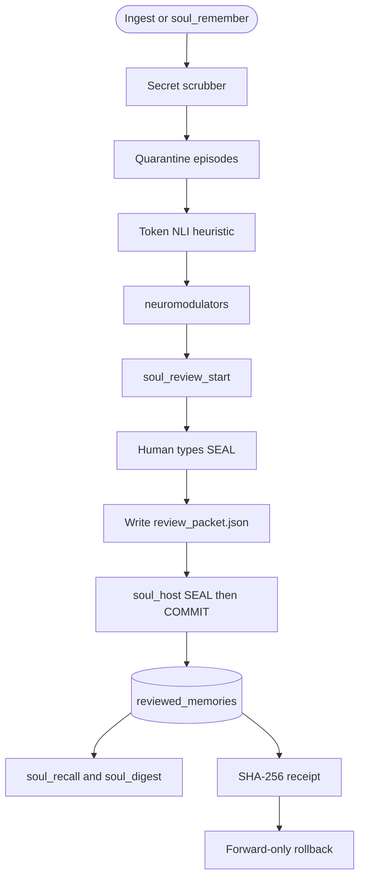

# Soul Engine (v1.1.1)
### *A Cognitive Identity and Epistemic Memory Kernel for Autonomous AI Agents*

[](LICENSE)
[](SECURITY.md)
[](https://www.python.org/downloads/)
[](https://modelcontextprotocol.io/)
[](EVAL_REPORT.md)
[](tests/)

Soul Engine is a local cognitive kernel for AI agents. It addresses three common limitations in agent systems: session amnesia, vulnerability to adversarial memory poisoning (gaslighting), and behavioral drift.

By combining an epistemic authority hierarchy with bio-homeostatic neuromodulation, Soul gives agents a durable core identity, prevents unverified claims from overwriting ground truth, and balances behavioral traits dynamically during task execution.

It runs locally with zero external database dependencies and connects to agent environments through the Model Context Protocol (MCP).

---

## Why Soul Engine

Most memory systems treat every ingested statement equally. If a prompt or tool output claims a repository is written in COBOL, standard stores overwrite established facts without validation. Most agents also operate on static system prompts without any mechanism to build confidence after breakthroughs or adopt caution after errors.

Soul Engine structures agent memory and behavior around three principles:

1. **Epistemic authority ranking**  
   Every memory record carries a provenance tag ($\text{verified} > \text{observed} > \text{inferred} > \text{reported} > \text{imagined}$). Unverified claims cannot overwrite verified ground truth. Conflicting statements are quarantined in an unresolved tension ledger for review.

2. **Bio-homeostasis and emotional balance**  
   Instead of relying on static instructions, the agent maintains an internal neuromodulatory state. Task successes release Dopamine (increasing audacity and curiosity), while errors trigger Cortisol (increasing humility and error anxiety). During resting periods, Serotonergic decay gradually returns traits toward constitutional baselines, preventing extreme overconfidence or chronic hesitation.

3. **Cryptographic state ledger and rollback**  
   Every state change and memory record is stored in an append-only SHA-256 ledger. If state corruption or drift occurs, the system can restore a previous checkpoint (v1.0 measure: under $2\text{ ms}$; not re-timed on 1.1.1).

---

## Quickstart: installation

Install Soul Engine (database + optional JSON MCP configs):

```bash
# Clone the repository
git clone https://github.com/Azhonaras/soul-engine.git
cd soul-engine

# Run the universal installer
python install.py
```

`install.py` creates `~/.soul/soul.db` and copies the **same** `soul-seal` skill into the standard skill dirs on the machine that runs it:

* Claude Code — `~/.claude/skills/soul-seal/SKILL.md`
* Hermes Agent — `~/.hermes/skills/soul-seal/SKILL.md`
* Antigravity — `~/.gemini/config/skills/soul-seal/SKILL.md` (CLI also `~/.gemini/antigravity-cli/skills/soul-seal/`)
* Cursor — `~/.cursor/skills/soul-seal/SKILL.md`
* Pi — `~/.pi/agent/skills/soul-seal/SKILL.md`
* Shared Agent Skills — `~/.agents/skills/soul-seal/SKILL.md` (Pi, Antigravity, and others that scan this dir)

Any other host: same file if it loads Agent Skills; otherwise the MCP server `instructions` field. Type **`SEAL`**. No Cursor-only path.

Soul is **one** stdio MCP server. Same command, same 20 tools, same review. If a step cannot be done in Claude, Hermes, Antigravity, Cursor, and Pi, it is not part of the product.

### MCP (same server, every harness)

```
command: python
args: ["-m", "soul_mcp_server"]
env: SOUL_DB_PATH=<path to soul.db>
```

`python -m soul_mcp_server` works after `python install.py` or `pip install -e .`. Without that, set `args` to the full path of `soul_mcp_server.py` in the clone — that is what `install.py` writes into JSON MCP configs. Windows: `py -3 -m soul_mcp_server`. After install, `soul-mcp` is on PATH.

**Claude Desktop** (`mcpServers` in `claude_desktop_config.json`):

```json
{
  "mcpServers": {
    "soul": {
      "command": "python",
      "args": ["-m", "soul_mcp_server"],
      "env": { "SOUL_DB_PATH": "/home/you/.soul/soul.db" }
    }
  }
}
```

**Hermes Agent** (`mcp_servers` in `~/.hermes/config.yaml`; see [Hermes MCP](https://hermes-agent.nousresearch.com/docs/user-guide/features/mcp)):

```yaml
mcp_servers:
  soul:
    command: "python"
    args: ["-m", "soul_mcp_server"]
    env:
      SOUL_DB_PATH: "/home/you/.soul/soul.db"
```

**Antigravity** (`mcpServers` in `~/.gemini/config/mcp_config.json` — same JSON as Claude):

```json
{
  "mcpServers": {
    "soul": {
      "command": "python",
      "args": ["-m", "soul_mcp_server"],
      "env": { "SOUL_DB_PATH": "/home/you/.soul/soul.db" }
    }
  }
}
```

Cursor, Pi, Goose, and every other MCP client: paste that same `command` / `args` / `env` into that client’s config (JSON or YAML) and reload. `install.py` writes JSON configs when those files already exist (Claude Desktop, Antigravity, Cursor). It does not write YAML (add the Hermes block by hand).

### Human review (same for every harness)

Type **`SEAL`** in the agent chat. That is the only product trigger. Some IDEs also expose this skill as `/soul-seal`; that is the same interview, not a second command. There is no `/Soul_Seal`.

The agent shows one quarantined fact and five choices you can pick or edit (remember / correct / session_only / reject / defer). Idle / bye / wrap-up do not commit.

MCP cannot set `origin_kind=human`. After the interview the agent writes `review_packet.json`. Then **you** in a terminal:

```bash
py -3 -m soul_host seal review_packet.json
```

Type `SEAL` (one human event per decision), then `COMMIT` on the exact preview. The agent must not run `soul_host`. `soul_review_commit` is the same MCP tool everywhere; it only succeeds after that human row exists.

`install.py` copies `skills/soul-seal/SKILL.md` into Claude Code, Hermes, Antigravity, Cursor, Pi, and `~/.agents/skills`. The MCP server `instructions` field is the fallback so a host with no skills still runs the same SEAL interview.

---

## Architecture

```
                         THE SOUL COGNITIVE LOOP (v1.1.1)
 ┌─────────────────────────────────────────────────────────────────────────┐
 │ 1. INGESTION & DEFENSE                                                  │
 │    New Observation ──► Secret Scrubber ──► Epistemic Provenance Check  │
 │    (verified > observed > inferred > reported > imagined)              │
 ├─────────────────────────────────────────────────────────────────────────┤
 │ 2. CONTRADICTION RESOLUTION & QUARANTINE                                │
 │    Candidate Top-5 Search ──► Token NLI heuristic ──► Tensions ledger  │
 ├─────────────────────────────────────────────────────────────────────────┤
 │ 3. BIO-HOMEOSTATIC NEUROMODULATION                                      │
 │    Task Success (+Valence) ──► Dopamine Surge (Audacity ↑, Anxiety ↓)   │
 │    Task Failure (-Valence) ──► Cortisol Surge (Humility ↑, Anxiety ↑)   │
 │    Idle Rest Cycles        ──► Serotonergic Decay (λ = 0.15)            │
 ├─────────────────────────────────────────────────────────────────────────┤
 │ 4. CRYPTOGRAPHIC STATE LEDGER                                           │
 │    SHA-256 Merkle Chain ──► Point-in-Time State Rollback (v1.0: < 2 ms) │
 ├─────────────────────────────────────────────────────────────────────────┤
 │ 5. HUMAN REVIEW CYCLE GOVERNANCE (v1.1.1)                               │
 │    Watermark Freezes ──► Pre-Commit Diffs ──► SHA-256 Commit Receipts   │
 │    Forward-Only Rollback (V → V+1) ──► Salt-Nullified Privacy Erasure   │
 └─────────────────────────────────────────────────────────────────────────┘
```



Default **`soul_recall` / `soul_digest` read `reviewed_memories` only**. Quarantined episodes stay on disk until review commit. That is long-term memory, not “ingest = recall.”

---

## Industry benchmark comparison

| Dimension | **Soul Engine (v1.1.1)** | **Mem0** | **Letta (MemGPT)** | **Zep (Graphiti)** | **Reflexion** |
| :--- | :---: | :---: | :---: | :---: | :---: |
| **Primary Approach** | **Epistemic Bio-Homeostasis** | Semantic Fact Store | OS Context Paging | Temporal Graph | Verbal RL Buffer |
| **Epistemic Authority Ranking** | **Yes ($\text{verified} > \dots > \text{imagined}$)** | No | No | No | No |
| **Byzantine Gaslighting Defense** | **Quarantine + token NLI heuristic** | 0% (Blind overwrite) | 0% (Blind write) | Partial (Appends) | 0% |
| **Bio-Neuromodulation Loop** | **Yes (Dopamine, Cortisol, Serotonin)** | No | No | No | No |
| **Constitutional Trait Bounds** | **Yes (Mathematical Clamping)** | No | No | No | No |
| **Cryptographic Hash Ledger** | **Yes (SHA-256 State Auditing)** | No | No | No | No |
| **Ingestion Latency (p50 / p95)** | **3.38 ms / 3.85 ms (v1.0 measure)** | ~50-150 ms (Cloud) | ~80-200 ms | ~40-120 ms | N/A |
| **Concurrent ACID Reliability** | **113.6 ops/s (v1.0 measure)** | Backend-dependent | Server-bound | Cloud-bound | Local single-thread |
| **Credential & Secret Scrubbing** | **Regex intercept (not a perfect DLP)** | No | No | No | No |
| **Interface Standard** | **Native 20-tool JSON-RPC MCP** | Custom SDK / REST | REST / CLI | REST / Cloud API | Python Script |

---

## The 20 Model Context Protocol (MCP) tools

Soul Engine exposes 12 core tools plus 8 review-cycle tools.

### Ingestion and memory management
* **`soul_remember`**: Writes interaction episodes into quarantined memory with automated secret filtering and entity key supersession.
* **`soul_verify`**: Evaluates new claims against established ground truth using the epistemic hierarchy (local token-overlap NLI heuristic, not a transformer).
* **`soul_recall`**: Default search of **reviewed (long-term) memory** via FTS5 BM25 plus a hashing/dense vector fallback (`sentence-transformers` optional). Pass `include_quarantined=True` only on the kernel for review/debug — MCP default is reviewed-only.
* **`soul_digest`**: Compact traits + neuromodulators + **reviewed** facts for a system prompt. Unreviewed episodes are omitted.

### Identity governance and homeostasis
* **`soul_get_identity`**: Inspects current trait levels, neuromodulators, and unresolved tensions.
* **`soul_reward`**: Adjusts Dopamine and Cortisol from `valence` ∈ [-1.0, 1.0]; values persist in the `neuromodulators` table. Serotonin is `1 - max(DA, cortisol)`.
* **`soul_update_trait`**: Updates constitutional behavioral traits within bounded limits. MCP cannot set `is_human_approved`.
* **`soul_heal`**: Recalibrates traits. MCP requires `human_event_ref`.

### Reflection, simulation, and recovery
* **`soul_reflect`**: Synthesizes unresolved tensions into higher-order generalized beliefs.
* **`soul_dream`**: Runs counterfactual simulations tagged with the provenance level `imagined`.
* **`soul_rollback`**: Restores identity to a previous version (forward-only). MCP requires `human_event_ref`.
* **`soul_daemon_status`**: Reports health metrics from the background worker.

### Review cycle (human host event required to commit)
* **`soul_host_event`**: Appends a tamper-evident host event. MCP origin is never `human`.
* **`soul_review_start`** / **`soul_review_status`** / **`soul_review_stage_decision`** / **`soul_review_preview`** / **`soul_review_commit`**
* **`soul_memory_rollback`** / **`soul_memory_delete`**: Require `human_event_ref`.

---

## Mathematical formulation

### 1. Neuromodulatory dynamics
When an agent receives task feedback with valence $v \in [-1.0, 1.0]$ and confidence $c \in [0.0, 1.0]$:

$$\text{Positive Reward } (v > 0): \quad \Delta\text{Dopamine} = 0.4 \cdot v \cdot c, \quad \Delta\text{Audacity} = +7.0 \cdot v \cdot c, \quad \Delta\text{Anxiety} = -3.0 \cdot v \cdot c$$

$$\text{Constructive Failure } (v < 0): \quad \Delta\text{Cortisol} = 0.5 \cdot |v| \cdot c, \quad \Delta\text{Humility} = +6.0 \cdot |v| \cdot c, \quad \Delta\text{Audacity} = -5.0 \cdot |v| \cdot c$$

### 2. Serotonergic homeostatic decay
During resting intervals, traits decay toward their constitutional baseline set points $S_0$:

$$T_{t+1} = T_t + \lambda \cdot (S_0 - T_t), \quad \text{where } \lambda = 0.15$$

### 3. Hybrid Reciprocal Rank Fusion (RRF)
$$\text{RRF Score}(d) = \frac{0.6}{60 + \text{rank}_{\text{dense}}(d)} + \frac{0.4}{60 + \text{rank}_{\text{FTS5}}(d)}$$

---

## Testing and verification suite

Soul Engine is tested against ISO/IEC/IEEE 29119 software standards:

```bash
# 1. Run the full automated suite (from repo root)
python -m unittest discover -s tests

# 2. Run high-concurrency stress (20 threads / 500 ops) and Byzantine defense tests
python tests/test_industry_grade.py

# 3. Run bio-homeostatic neuromodulation simulation
python tests/test_bio_reward.py

# 4. Run latency benchmarks (p50 / p95)
python tests/test_benchmark.py

# 5. Demo: quarantine vs long-term reviewed memory (plus reward/homeostasis)
python examples/demo_live_agent.py
```

---

## Contributors & attribution

* **Azhonaras (Navid Badami)**: Creator, Lead Architect & Maintainer
* **Antigravity (UPI)**: Co-author & Verification Assistant (v1.1.0)
* **Soul Open Source Community**: Contributions, Feedback & Testing

---

## License

Soul Engine is released under the open-source [MIT License](LICENSE).  
Copyright (c) 2026 Azhonaras (Navid Badami), and Soul Contributors.
