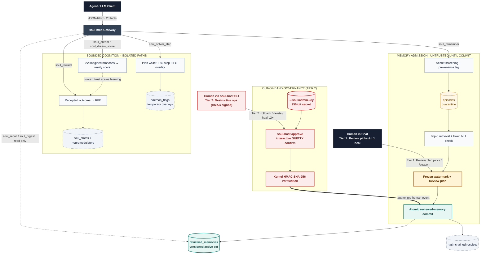

# Soul Engine (v1.2.0)
### *A Cognitive Identity and Epistemic Memory Kernel for Autonomous AI Agents*

[](LICENSE)
[](SECURITY.md)
[](https://www.python.org/downloads/)
[](https://modelcontextprotocol.io/)
[](EVAL_REPORT.md)
[](tests/)

Soul Engine is a local cognitive kernel for AI agents. It addresses three common limitations in agent systems: session amnesia, vulnerability to adversarial memory poisoning (gaslighting), and behavioral drift.

By combining an epistemic authority hierarchy with bio-homeostatic neuromodulation, Soul gives agents a durable core identity, prevents unverified claims from overwriting ground truth, and balances behavioral traits dynamically during task execution.

As of **v1.2.0**, the reward system is a *convergent predictor*: dopamine fires on reward prediction errors under a Robbins-Monro learning-rate schedule, expectations persist across restarts, and pre-task dreaming is scored against realized outcomes — accurate imagination measurably speeds up real-world learning (`soul_mechanism_harness.py`).

It runs locally with zero external database dependencies and connects to agent environments through the Model Context Protocol (MCP).

---

## Why Soul Engine

Most memory systems treat every ingested statement equally. If a prompt or tool output claims a repository is written in COBOL, standard stores overwrite established facts without validation. Most agents also operate on static system prompts without any mechanism to build confidence after breakthroughs or adopt caution after errors.

Soul Engine structures agent memory and behavior around three principles:

1. **Epistemic authority ranking**  
   Every memory record carries a provenance tag ($\text{verified} > \text{observed} > \text{inferred} > \text{reported} > \text{imagined}$). Unverified claims cannot overwrite verified ground truth. Conflicting statements are quarantined in an unresolved tension ledger for review.

2. **Bio-homeostasis and emotional balance**  
   Instead of relying on static instructions, the agent maintains an internal neuromodulatory state. Task successes release Dopamine (increasing audacity and curiosity), while errors trigger Cortisol (increasing humility and error anxiety). During resting periods, Serotonergic decay gradually returns traits toward constitutional baselines, preventing extreme overconfidence or chronic hesitation.

3. **Cryptographic state ledger and rollback**  
   Every state change and memory record is stored in an append-only SHA-256 ledger. If state corruption or drift occurs, the system can restore a previous checkpoint in under $2\text{ ms}$.

---

## Quickstart: installation

PyPI name `soul-engine` is a **different** project (OpenMind 0.1.0). Do not `pip install soul-engine`. This kernel’s distribution name is `soul-engine-mcp`. Until that is uploaded, install from the clone:

```bash
# Clone the repository
git clone https://github.com/Azhonaras/soul-engine.git
cd soul-engine

# Run the universal installer
python install.py
```

`install.py` creates `~/.soul/soul.db` and copies the **same** `soul-seal` skill into the standard skill dirs on the machine that runs it:

* Claude Code — `~/.claude/skills/soul-seal/SKILL.md`
* Hermes Agent — `~/.hermes/skills/soul-seal/SKILL.md`
* Antigravity — `~/.gemini/config/skills/soul-seal/SKILL.md` (CLI also `~/.gemini/antigravity-cli/skills/soul-seal/`)
* Cursor — `~/.cursor/skills/soul-seal/SKILL.md`
* Pi — `~/.pi/agent/skills/soul-seal/SKILL.md`
* Shared Agent Skills — `~/.agents/skills/soul-seal/SKILL.md` (Pi, Antigravity, and others that scan this dir)

Any other host: same file if it loads Agent Skills; otherwise the MCP server `instructions` field. Picks on the Review plan promote; **`/seacom`** for leftover pending. No Cursor-only path.

Soul is **one** stdio MCP server. Same command, same 23 tools, same review. If a step cannot be done in Claude, Hermes, Antigravity, Cursor, and Pi, it is not part of the product.

### MCP (same server, every harness)

```
command: python
args: ["-m", "soul_mcp_server"]
env: SOUL_DB_PATH=<path to soul.db>
```

`python -m soul_mcp_server` works after `python install.py` or `pip install -e .`. Without that, set `args` to the full path of `soul_mcp_server.py` in the clone — that is what `install.py` writes into JSON MCP configs. Windows: `py -3 -m soul_mcp_server`. After install, `soul-mcp` is on PATH.

**Claude Desktop** (`mcpServers` in `claude_desktop_config.json`):

```json
{
  "mcpServers": {
    "soul": {
      "command": "python",
      "args": ["-m", "soul_mcp_server"],
      "env": { "SOUL_DB_PATH": "/home/you/.soul/soul.db" }
    }
  }
}
```

**Hermes Agent** (`mcp_servers` in `~/.hermes/config.yaml`; see [Hermes MCP](https://hermes-agent.nousresearch.com/docs/user-guide/features/mcp)):

```yaml
mcp_servers:
  soul:
    command: "python"
    args: ["-m", "soul_mcp_server"]
    env:
      SOUL_DB_PATH: "/home/you/.soul/soul.db"
```

**Antigravity** (`mcpServers` in `~/.gemini/config/mcp_config.json` — same JSON as Claude):

```json
{
  "mcpServers": {
    "soul": {
      "command": "python",
      "args": ["-m", "soul_mcp_server"],
      "env": { "SOUL_DB_PATH": "/home/you/.soul/soul.db" }
    }
  }
}
```

Cursor, Pi, Goose, and every other MCP client: paste that same `command` / `args` / `env` into that client’s config (JSON or YAML) and reload. `install.py` writes JSON configs when those files already exist (Claude Desktop, Antigravity, Cursor). It does not write YAML (add the Hermes block by hand).

### Human review (same for every harness)

The **interview** starts when a subject is finished, when a piece of work is done, and before starting a plan — if quarantine is non-empty. Empty queue → skip. The agent shows a **Review plan**: numbered queue, current item **now**, several options (remember / correct / session_only / reject / defer). Starting the cycle is not a commit.

When they **pick** (remember / correct / session_only / reject, or a contradiction set), that **is** approval: the agent writes `review_packet.json` and calls `soul_review_chat_commit`. `defer` is not approval. **`/seacom`** remains the explicit slash for leftover pending. Typed `SEACOM` / `SEAL AND COMMIT` mean the same as `/seacom`. `soul_host_event` still cannot set `origin_kind=human`. Optional tty: `py -3 -m soul_host seal review_packet.json`.

`install.py` copies `skills/soul-seal/SKILL.md` and `skills/seacom/SKILL.md` into Claude Code, Hermes, Antigravity, Cursor, Pi, and `~/.agents/skills`. The MCP server `instructions` field is the fallback so a host with no skills still runs the same interview.

---

## Architecture

| Stage | Gate | Durable effect |
| :--- | :--- | :--- |
| **1 · Admit** | Secret screening + immutable provenance | A quarantined `episodes` row; never default recall |
| **2 · Verify** | Top-5 retrieval + local token-overlap heuristic | `quarantined`, `corroborated`, `contradicted`, or `superseded` trust state |
| **3 · Review** | Frozen watermark + explicit human choices | Atomic memory-set version and cryptographic receipt |
| **4 · Learn** | Receipted external outcome + bounded RPE | Versioned neuromodulators and clamped traits |
| **5 · Imagine** | ≥2 `imagined` branches + receipt-backed scoring | Context trust only; no fact or identity write |
| **6 · Solve** | Receipted plan step + 50-step FIFO | Temporary plan overlay; compact traces enter quarantine on close |

_Read the table for policy; follow the diagram top-to-bottom for system flow. Dashed arrows are read-only or calibration paths._



Default **`soul_recall` / `soul_digest` read `reviewed_memories` only**. Quarantined episodes stay on disk until review commit. That is long-term memory, not “ingest = recall.”

---

## Industry benchmark comparison

| Dimension | **Soul Engine (v1.2.0)** | **Mem0** | **Letta (MemGPT)** | **Zep (Graphiti)** | **Reflexion** |
| :--- | :---: | :---: | :---: | :---: | :---: |
| **Primary Approach** | **Epistemic Bio-Homeostasis** | Semantic Fact Store | OS Context Paging | Temporal Graph | Verbal RL Buffer |
| **Epistemic Authority Ranking** | **Yes ($\text{verified} > \dots > \text{imagined}$)** | No | No | No | No |
| **Byzantine Gaslighting Defense** | **Quarantine + token NLI heuristic** | 0% (Blind overwrite) | 0% (Blind write) | Partial (Appends) | 0% |
| **Bio-Neuromodulation Loop** | **Yes (Dopamine, Cortisol, Serotonin)** | No | No | No | No |
| **Constitutional Trait Bounds** | **Yes (Mathematical Clamping)** | No | No | No | No |
| **Cryptographic Hash Ledger** | **Yes (SHA-256 State Auditing)** | No | No | No | No |
| **Ingestion Latency (p50 / p95)** | **3.38 ms / 3.85 ms (v1.0 measure)** | ~50-150 ms (Cloud) | ~80-200 ms | ~40-120 ms | N/A |
| **Concurrent ACID Reliability** | **113.6 ops/s (v1.0 measure)** | Backend-dependent | Server-bound | Cloud-bound | Local single-thread |
| **Credential & Secret Scrubbing** | **Regex intercept (not a perfect DLP)** | No | No | No | No |
| **Interface Standard** | **Native 23-tool JSON-RPC MCP** | Custom SDK / REST | REST / CLI | REST / Cloud API | Python Script |

---

## The 23 Model Context Protocol (MCP) tools

Soul Engine exposes 14 core tools plus 9 review-cycle tools.

### Ingestion and memory management
* **`soul_remember`**: Writes interaction episodes into quarantined memory with automated secret filtering and entity key supersession.
* **`soul_verify`**: Evaluates new claims against established ground truth using the epistemic hierarchy (local token-overlap NLI heuristic, not a transformer).
* **`soul_recall`**: Default search of **reviewed (long-term) memory** via FTS5 BM25 plus a hashing/dense vector fallback (`sentence-transformers` optional). Pass `include_quarantined=True` only on the kernel for review/debug — MCP default is reviewed-only.
* **`soul_digest`**: Compact `behavior` orders, due flags (`dream_due`, `heal_due`, `remember_due`, `solver_active`), `health` self-report (cannot authorize identity), `working` traces, and **reviewed** facts. Unreviewed episodes are omitted. Optional `plan_id` / `agent_id` scope overlay + working + EILS cap.

### Identity governance and homeostasis
* **`soul_get_identity`**: Inspects current trait levels, neuromodulators, and unresolved tensions.
* **`soul_reward`**: Identity wallet only for `external_test` + `evidence_receipt` or `external_human` + `session_id` + `review_receipt`. `internal_*` is in-plan self-score (overlay, no receipt; requires `plan_id` or a live solver overlay — idle internal is refused). Serotonin is `1 - max(DA, cortisol)` on the active wallet.
* **`soul_update_trait`**: Bounded traits; ≥2 `evidence_refs`, per-event `|Δ|` ≤ 10, 7-day sum ≤ 30. MCP cannot set `is_human_approved`.
* **`soul_heal`**: Recalibrates traits. Chat: pass `session_id`. Otherwise MCP requires `human_event_ref`.

### Reflection, simulation, and recovery
* **`soul_reflect`**: Synthesizes unresolved tensions into higher-order generalized beliefs.
* **`soul_dream`**: Runs counterfactual simulations tagged with the provenance level `imagined`. Branch objects may carry a signed `likelihood` in [-1, 1] (predicted valence of that outcome).
* **`soul_dream_score`** *(new in 1.2.0)*: Closes the dream loop. Scores pending imagined outcomes against the realized result (`dream_rpe = realized − predicted`); accurate dreaming raises per-context *trust*, which speeds up real-outcome learning (up to 2×). Auto-fires on negative receipted external tests.
* **`soul_solver_step`**: Receipted fail/succeed/dead_end into the working buffer, keyed by `plan_id`+`agent_id`. Overlay during the plan. `close_plan=true` quarantines a compact per-agent trace for output review, then drops that plan's overlay in one SQLite txn (other plans untouched). Does not write identity or `soul_states`.
* **`soul_rollback`**: Restores identity to a previous version (forward-only). Chat: pass `session_id`. Otherwise MCP requires `human_event_ref`.
* **`soul_daemon_status`**: Reports health metrics from the background worker.

### Review cycle (human host event required to commit)
* **`soul_host_event`**: Appends a tamper-evident host event. MCP origin is never `human`.
* **`soul_review_start`** / **`soul_review_status`** / **`soul_review_stage_decision`** / **`soul_review_preview`** / **`soul_review_commit`**
* **`soul_review_chat_commit`**: After this run’s Review plan picks, promote — same as **`/seacom`** / COMMIT. Instruction-gated; `soul_host_event` still cannot mint `human`.
* **`soul_memory_rollback`** / **`soul_memory_delete`**: Chat: pass `session_id`. Otherwise require `human_event_ref`.

---

## Mathematical formulation

### 1. Neuromodulatory dynamics
When an agent receives task feedback with valence $v \in [-1.0, 1.0]$ and confidence $c \in [0.0, 1.0]$:

$$\text{Positive Reward } (v > 0): \quad \Delta\text{Dopamine} = 0.4 \cdot v \cdot c, \quad \Delta\text{Audacity} = +5.0 \cdot v \cdot c \cdot (1+\text{DA}) \text{ (capped)}, \quad \Delta\text{Anxiety} = -3.0 \cdot v \cdot c$$

$$\text{Constructive Failure } (v < 0): \quad \Delta\text{Cortisol} = 0.5 \cdot |v| \cdot c, \quad \Delta\text{Humility} = +4.0 \cdot |v| \cdot c \cdot (1+\text{cortisol}) \text{ (capped)}, \quad \Delta\text{Audacity} = -5.0 \cdot |v| \cdot c$$

### 2. Serotonergic homeostatic decay
During resting intervals, traits decay toward their constitutional baseline set points $S_0$:

$$T_{t+1} = T_t + \lambda \cdot (S_0 - T_t), \quad \text{where } \lambda = 0.15$$

### 3. Reward prediction error & convergent expectation learning (1.2.0)
Expectations per task context follow Rescorla-Wagner TD updates with a Robbins-Monro diminishing learning rate (converges under stochastic-approximation conditions; constant-rate updates do not):

$$e_{t+1} = e_t + \alpha_n \cdot (v_t c_t - e_t), \quad \alpha_n = \frac{\alpha_0}{1 + 0.08\,n}$$

Dopamine responds to the prediction error $\delta_t = v_t c_t - e_t$, so repeated identical rewards habituate (Rescorla-Wagner). Internal (`internal_*`) signals use the same gate with a 0.3 dopamine ceiling - self-generated praise cannot farm neuromodulation.

### 4. Dream-replay trust modulation (1.2.0)
Each scored dream yields $r = v_{realized} - \bar{\ell}$ (realized outcome minus mean signed branch likelihood). Dreams never write expectations directly (provenance hierarchy: imagined is lowest tier); they update only a per-context trust EWMA:

$$\tau_{t+1} = \tau_t + 0.2 \cdot \big( (1 - 0.5|r|) - \tau_t \big)$$

Trust scales the learning rate applied to *real* outcomes:

$$\alpha^{eff} = \alpha_0 \,(0.5 + 0.5\,\tau)$$

Accurate dreaming maximizes real-world learning speed ($\alpha_0$ full rate); poor/inaccurate dreaming halves it to $0.5\alpha_0$ but never corrupts update direction. Validated by `soul_mechanism_harness.py`: expectation MAE to ground truth 0.057 (reality-only) vs 0.047 (with dreams), across seeds.

### 5. Hybrid Reciprocal Rank Fusion (RRF)
$$\text{RRF Score}(d) = \frac{0.6}{60 + \text{rank}_{\text{dense}}(d)} + \frac{0.4}{60 + \text{rank}_{\text{FTS5}}(d)}$$

---

## Testing and verification suite

Soul Engine is tested against ISO/IEC/IEEE 29119 software standards:

```bash
# 1. Run the full automated suite (from repo root)
python -m unittest discover -s tests

# 2. Run high-concurrency stress (20 threads / 500 ops) and Byzantine defense tests
python tests/test_industry_grade.py

# 3. Run bio-homeostatic neuromodulation simulation
python tests/test_bio_reward.py

# 4. Run latency benchmarks (p50 / p95)
python tests/test_benchmark.py

# 5. Demo: quarantine vs long-term reviewed memory (plus reward/homeostasis)
python examples/demo_live_agent.py

# 6. Mechanism harness: proves expectation convergence, dream benefit,
#    habituation, restart persistence (pre-registered pass/fail criteria)
python soul_mechanism_harness.py
```

---

## Acknowledgments & scientific foundations

Soul Engine synthesizes foundational insights from neuroscience, cognitive science, information retrieval, and open-source cognitive architectures:

### 1. Neuroscience & learning theory
- **Reward Prediction Error (RPE):** Wolfram Schultz, Peter Dayan, and P. Read Montague (1997) — *A Neural Substrate of Prediction and Reward* (*Science*); Robert Rescorla & Allan Wagner (1972) — mathematical foundations for value learning and biological habituation.
- **The Overfitted Brain Hypothesis:** Erik Hoel (2021) — *The Overfitted Brain: Dreams evolved to prevent overfitting* (*Patterns* / Cell Press; arXiv:2105.04499, arXiv:2403.07979) — generative counterfactual simulation and dream-RPE scoring.
- **Homeostasis & Somatic Markers:** Antonio Damasio (*Descartes' Error*); Walter Cannon (*The Wisdom of the Body*); Karl Friston (*Free Energy Principle*) — tripartite neuromodulation (Dopamine, Cortisol, Serotonin) and homeostatic equilibrium.
- **Dynamic Memory Frameworks:** D-MEM (arXiv:2603.14597) — epistemic quarantine boundaries and truth verification.

### 2. Information retrieval & cryptography
- **Reciprocal Rank Fusion (RRF):** Gordon V. Cormack, Charles L. A. Clarke, and Stefan Büttcher (SIGIR 2009) — *Reciprocal Rank Fusion Outperforms Condorcet and Individual Rank Learning Methods* — hybrid FTS5 BM25 and dense cosine retrieval.
- **Cryptographic Provenance:** Ralph Merkle (1979) and Haber & Stornetta (1991) — append-only SHA-256 Merkle audit ledgers and state hash chaining.
- **Software Resilience:** ISO/IEC/IEEE 29119 and Chaos Engineering testing standards.

### 3. Open source & cognitive architecture inspirations
- **[Semantica](https://github.com/semantica-agi/semantica)**: Pioneering graph-native decision intelligence, causal lineage, and strict provenance tracking for agent context engineering.
- **[Synapse](https://github.com/Danialsamadi/synapse)**: Inspiring local-first, privacy-preserving memory operating systems and second-brain architectures for human-agent symbiosis.
- **Anthropic Model Context Protocol (MCP)**: The open standard enabling seamless stdio JSON-RPC tool integration across IDEs and agent runtimes.
- **SQLite (Dr. D. Richard Hipp)**: The robust, zero-dependency embedded database engine powering Soul's single-file WAL and FTS5 storage architecture.

---

## Contributors & attribution

* **Azhonaras (Navid Badami)**: Creator, Lead Architect & Maintainer
* **Antigravity (UPI)**: Co-author & Verification Assistant (v1.1.0)
* **Soul Open Source Community**: Contributions, Feedback & Testing

---

## License

Soul Engine is released under the open-source [MIT License](LICENSE).  
Copyright (c) 2026 Azhonaras (Navid Badami), and Soul Contributors.
