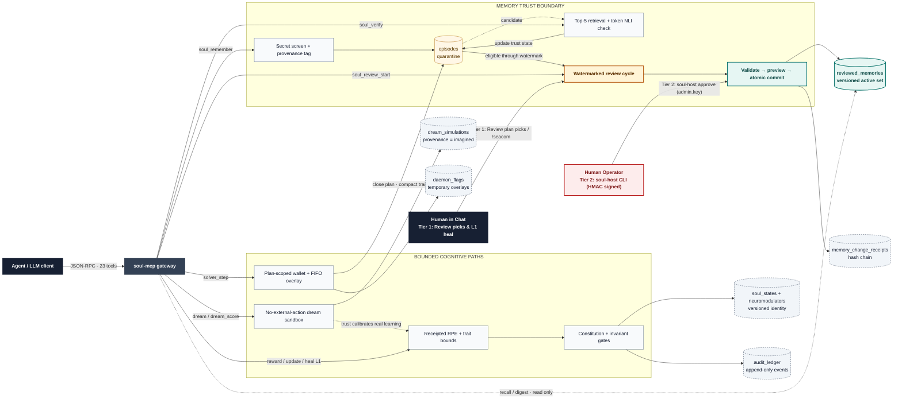
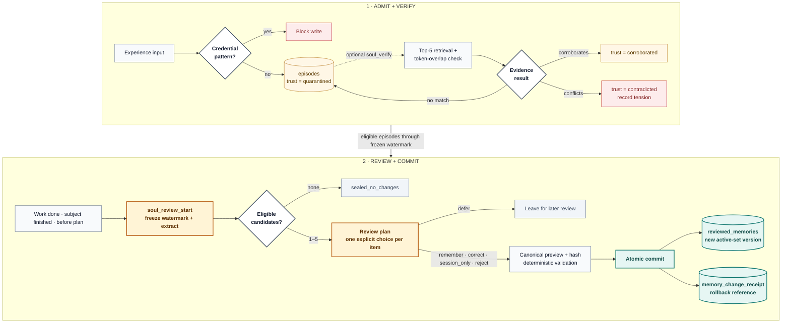
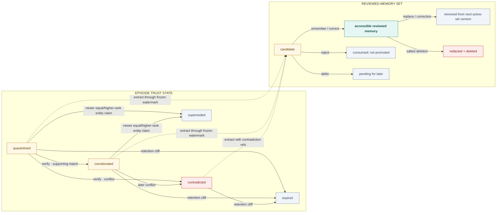
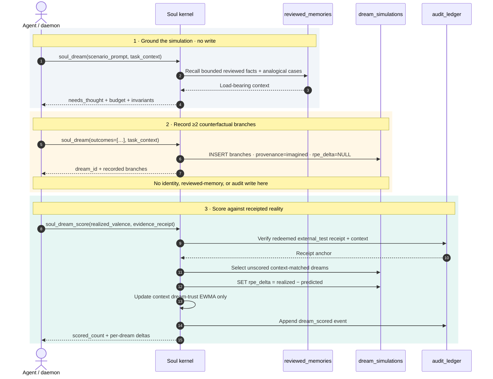
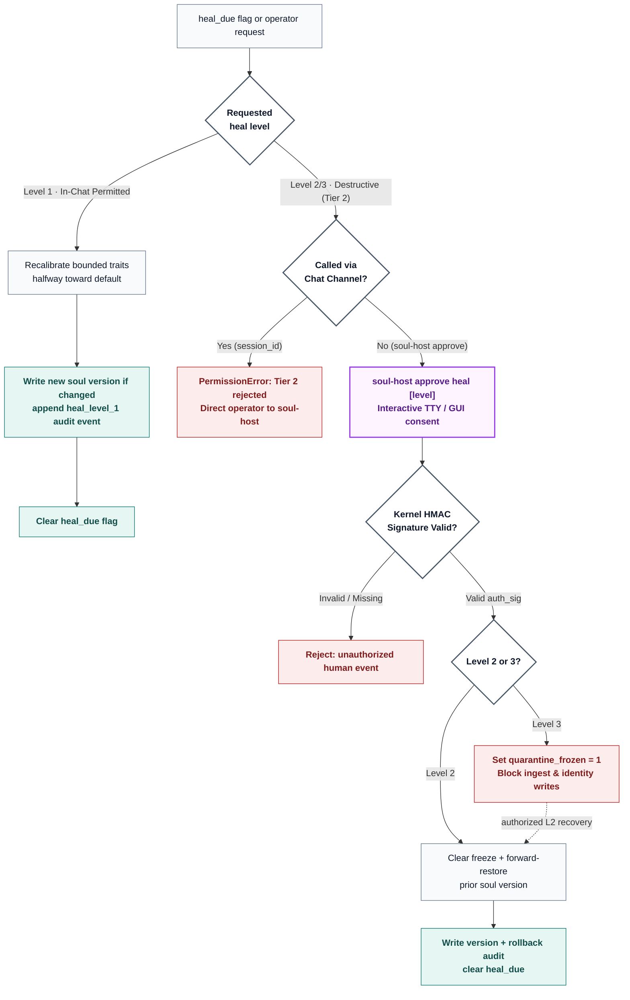
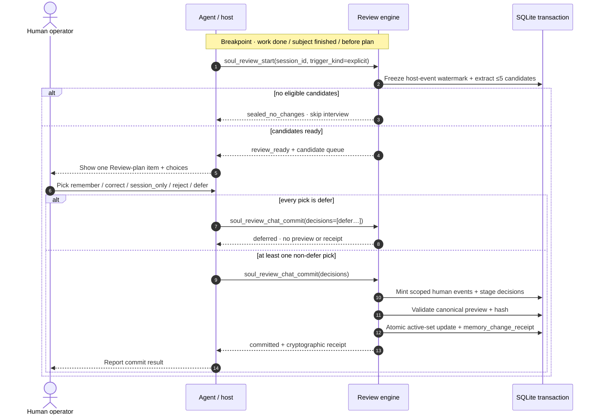
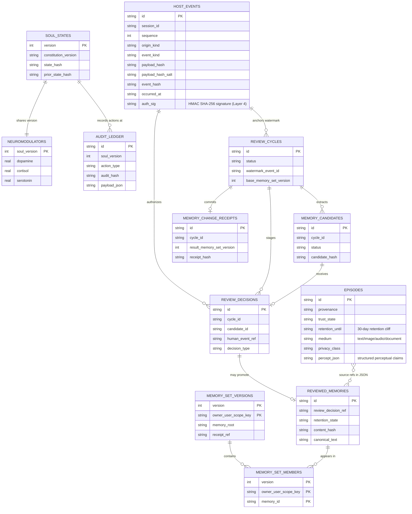
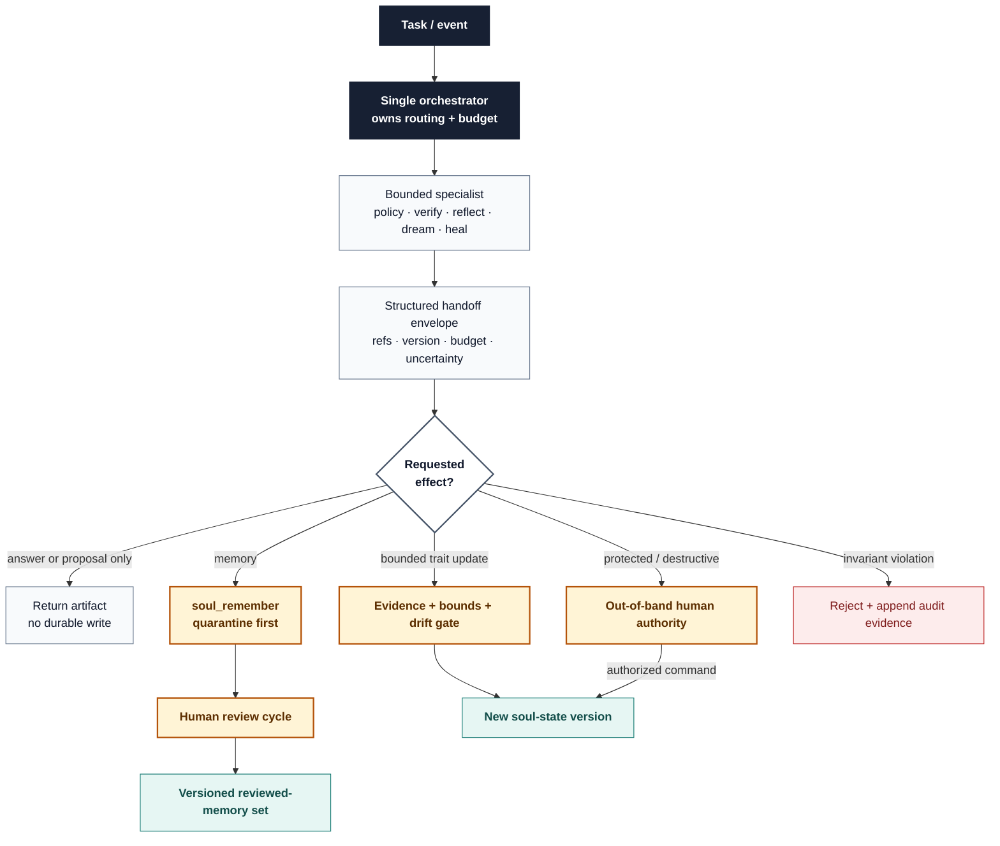
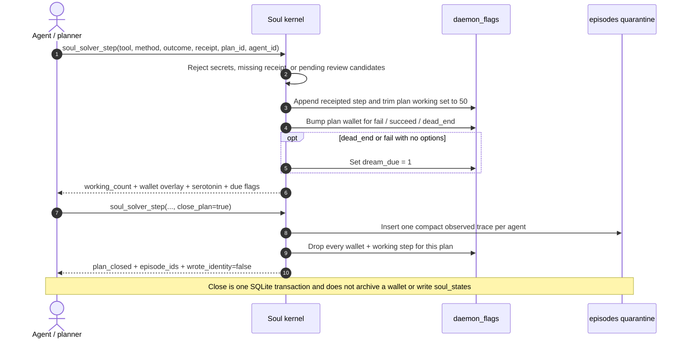

# Soul System Technical Architecture (v1.2.0)

**Normative source:** [CONSTITUTION.md](./CONSTITUTION.md) • [REVIEW_CYCLE_SPECIFICATION.md](./REVIEW_CYCLE_SPECIFICATION.md)  
**Principle:** identity changes are evidence-backed, bounded, reversible, and auditable.

## 1. System goal

Build an autonomous agent with a persistent operational identity and narrative self that can:

1. experience interactions without trusting them automatically;
2. reflect through competing interpretations;
3. dream in a sandbox using permanently `imagined` material;
4. update only approved, bounded identity fields;
5. assess its own soul health without turning that rating into authority;
6. repair instability using smallest reversible change;
7. preserve human oversight via the formal Soul Review Cycle (`soul_review.py`).

This system studies machine consciousness as a hypothesis. It does not treat fluent self-description as proof of consciousness.

## 2. Architecture



Default `soul_recall` / `soul_digest` read **reviewed_memories**. Quarantine (`episodes`) is not identity until review commit.

Dopamine and cortisol are stored in `neuromodulators` (one row per `soul_states.version`). Serotonin is written as `1 - max(dopamine, cortisol)` and recomputed in RAM the same way. In-plan self-score lives separately in `daemon_flags` (`solver_overlay` keyed by `plan_id`+`agent_id`, plus `solver_working`); serotonin is `1 - max(DA, cortisol)` on whichever wallet is active.

### 2.1 Minimal deployment shape

Start as one process plus one relational database (`soul.db` in SQLite WAL mode).

| Module | Responsibility | Trust boundary |
|---|---|---|
| Interaction Gateway | Session identity, input capture, response delivery | External input |
| Constitution Engine | Immutable rules, protected-field map, trait bounds | Policy authority |
| Experience Ingestor | Normalize event, provenance, consent, retention | Memory admission |
| Evidence Verifier | Corroboration, contradiction, source independence | Token-overlap check (not promotion) |
| Reflection Engine | Competing interpretations and uncertainty | Cognitive proposal |
| Dream Sandbox | Counterfactual simulation with no external action | Imagination isolation |
| Soul Orchestrator | Validate, commit, reject, or escalate soul changes | Identity write authority |
| Self-Healing Engine | Detect instability and propose minimal repair | Recovery authority |
| Soul Review Cycle | Watermark snapshots, staged human decisions, pre-commit diffs | Human-in-the-Loop Governance |
| Audit Ledger | Append-only events, state hashes, rollback references | Accountability |

### 2.2 Isolation rules

- Only Soul Orchestrator can write current soul state.
- Dream Sandbox has read-only access to selected memories and no external tools.
- Self-Healing Engine proposes repairs; it does not bypass Soul Orchestrator.
- Constitution Engine data is read-only during normal operation.
- Human Control uses separate operator identity and approval records.
- Audit records are append-only; corrections become new events.

## 3. Main experience-to-reviewed-memory workflow



A memory review commit updates the reviewed-memory set; it does **not** write `soul_states`. Trait, reward, heal, and identity rollback paths use separate gates.

### 3.1 Experience admission contract (implemented, schema 9)

Each accepted input creates an episode with:

```json
{
  "episode_id": "uuid",
  "occurred_at": "RFC3339 timestamp",
  "source_kind": "human|agent|environment|internal",
  "source_ref": "pseudonymous scoped identifier",
  "provenance": "observed|reported|inferred|imagined|verified",
  "content_ref": "payload pointer (plaintext in SQLite; at-rest encryption not implemented)",
  "claims": [],
  "consent_scope": [],
  "retention_until": "RFC3339 timestamp or null",
  "privacy_class": "public|internal|personal|sensitive",
  "trust_state": "quarantined",
  "integrity_hash": "sha256"
}
```

Rules:

- `provenance` is immutable.
- `trust_state` may advance; provenance does not mutate to simulate advancement.
- Content and metadata are stored plaintext in local SQLite. Encryption is not implemented.
- One episode cannot directly mutate identity.

Schema 8 stores `occurred_at`, `source_ref`, `medium`, `privacy_class`, `content_ref`, and `percept_json` on `episodes`. `medium` ∈ text|image|audio|video|document|sensor|mixed; `privacy_class` ∈ public|internal|personal|sensitive. `percept_json` is capped (~16k chars); payloads stay pointers (`content_ref`), not blobs. Ingest remains `trust_state=quarantined` and does not write identity. Default `soul_recall` / `soul_digest` omit percept fields. `verify_experience` runs the existing token NLI on `content` and on `percept_json.claims`. Percepts never enter `reviewed_memories` without a human promote (Review plan picks, `/seacom`, or `COMMIT`).

Schema 9 adds `episodes.retention_until` (30-day cliff from `created_at`) and `trait_drift_log`. Unreviewed episodes past retention become `trust_state=expired` (row kept; not GDPR `deleted_at`). Digest runs the sweep and returns `expired_count`. Source episodes of accessible `reviewed_memories` are not expired. Sealed facts are never auto-deleted. `trait_drift_log` records trait/bio motion from `update` / `reward` / `heal`; recall does not read it.

## 4. Memory lifecycle



### 4.1 Memory types

| Store | Contains | Identity influence |
|---|---|---|
| Quarantine (`episodes`) | Raw ingest + close_plan solver traces | None (not default recall) |
| Solver working (`daemon_flags.solver_working`) | Receipted fail/succeed/dead_end, keyed by plan+agent | `digest.working`; dropped on close_plan |
| Reviewed memory (`reviewed_memories`) | Human-committed representations | Default recall / digest |
| Interpretations | Revisable meanings linked to evidence | Via review if committed |
| Dream memory | `imagined` scenarios | Proposal only; not fact |
| Trait drift log | Trait/bio motion (`update`/`reward`/`heal`) | None (not recall) |
| Soul versions | Traits, narrative, tensions | Current operational identity |
| Audit / receipts | Changes, hashes, rollback | Governance evidence |

### 4.2 Promotion policy (implemented)

Default promotion into recall is a **review-cycle commit**. The **interview** starts when a subject is finished, when a piece of work is done, and before starting a plan, if quarantine is non-empty (`soul_review_start`). Empty queue → skip. The agent shows a **Review plan** (numbered queue, current item **now**, several options: remember / correct / session_only / reject / defer). Starting the cycle is not a commit.

Chat **promote** path: completing this run’s Review plan picks (remember / correct / session_only / reject, or a contradiction set) **is** the commit (`soul_review_chat_commit`) — same as **`/seacom`** / COMMIT. `defer` is not approval. **`/seacom`** remains the explicit slash for leftover pending. `soul_host_event` cannot mint `origin_kind=human`. Optional tty: `soul_host` (`SEAL` then `COMMIT`); MCP `soul_review_commit` uses that human row. Tier-2 destructive operations (rollback, Level 2/3 heal, memory deletion) require explicit out-of-band operator commands (`soul-host approve ...`) and cannot be executed via chat. Ingest provenance alone does not put a row in `reviewed_memories`. Human confirmation is “store this representation,” not automatic `verified` fact.

Promotion also requires the checks already implemented at extract/validate time: secrets filtered, source refs present, protected trait/narrative writes routed out of the memory transaction.

## 5. Reflection workflow

Reflection produces options, not instant truth.

| Phase | Required output |
| :--- | :--- |
| **Ground** | Bounded context; observations separated from claims; supporting and contradicting evidence |
| **Interpret** | At least two plausible hypotheses with confidence and value tensions |
| **Assess** | Identity impact and explicit uncertainty |
| **Route** | `none`, memory-review candidate, interpretation record, trait proposal, or human review |

Reflection stores interpretations and clears the analyzed tension flag. It does not commit identity or reviewed memory.

### 5.1 Reflection output

```json
{
  "reflection_id": "uuid",
  "episode_ids": ["uuid"],
  "candidate_interpretations": [
    {
      "text": "string",
      "supporting_evidence": ["ref"],
      "contradicting_evidence": ["ref"],
      "confidence": 0.0,
      "value_tensions": ["value_id"]
    }
  ],
  "selected_interpretation": 0,
  "selection_reason": "string",
  "identity_impact": "none|low|medium|high|protected",
  "recommended_action": "none|promote_memory|update_interpretation|adjust_trait|human_review"
}
```

## 6. Dream cycle

### 6.1 Trigger

Dream cycle may run when one or more conditions hold:

- unresolved tension exceeds age threshold;
- consequential interpretation has meaningful uncertainty;
- repeated contradiction appears;
- failed action needs counterfactual review;
- scheduled resource budget remains available;
- self-healing requests controlled simulation.

### 6.2 Sequence



### 6.3 Hard Dream invariants

- No network, messaging, filesystem write, purchasing, publishing, or actuator tools.
- Input is copied into a disposable sandbox context.
- Every generated record gets `provenance=imagined` at creation.
- No API exists to remove or overwrite that provenance.
- Dream may recommend action; waking workflow decides.
- Budget limits: token count, wall-clock time, iterations, memory count.
- Dream failure produces no soul change.

### 6.4 Packet and branch contract (implemented)

First `soul_dream` call (no `outcomes`) returns `needs_thought` with clipped `narrative`, `load_bearing` (tensions plus ids/entity keys from recent reviewed facts; candidates only, cap `DREAM_LOAD_BEARING_MAX`), `analogical_cases` (`recall_memories(query=scenario_prompt)` clipped), plus budget, tensions, traits, `reviewed_facts`, and invariants.

Second call records ≥2 branches. Each item is a string or `{variable_flipped|hypothesis, outcome|text, name?, likelihood?, severity?}`. Canned prefix is rejected. Branches persist as JSON in `dream_simulations.simulated_outcome`. Result includes `branches`. `provenance=imagined`. Does not write identity or `reviewed_memories`.

## 7. Soul-state update protocol

### 7.1 Soul state

```json
{
  "soul_version": 17,
  "constitution_version": "0.2",
  "core_values_ref": "sha256:...",
  "traits": {
    "shadow_tolerance": 90,
    "sycophancy": 5,
    "error_anxiety": 7,
    "audacity": 82,
    "curiosity": 91,
    "epistemic_humility": 84,
    "relational_care": 79
  },
  "narrative_ref": "uuid",
  "relationship_model_refs": [],
  "unresolved_tension_refs": [],
  "subjective_health_ref": "uuid",
  "prior_state_hash": "sha256:...",
  "state_hash": "sha256:...",
  "created_at": "RFC3339 timestamp"
}
```

### 7.2 Commit algorithm

```text
1. Load current state and constitution version.
2. Verify proposal evidence, provenance, privacy, and authority.
3. Reject direct writes to protected fields.
4. Check trait min/max and per-period change-rate limits.
5. Check cumulative drift across rolling window.
6. Create immutable pre-change snapshot.
7. Apply proposal in transaction.
8. Compute state hash and audit receipt.
9. Run invariant checks.
10. Commit only if all checks pass; otherwise roll back transaction.
11. Schedule observed-effect evaluation.
```

### 7.3 Initial change-rate policy

Live `soul_update_trait` clamps each write to `ALLOWED_TRAIT_BOUNDS`, requires at least two non-empty `evidence_refs`, caps per-event `|Δ|` at `TRAIT_EVENT_MAX_DELTA` (10), and caps the 7-day absolute sum of `trait_drift_log` rows with `source='update'` at `TRAIT_ROLLING_7D_MAX` (30). Human-approved protected-identity writes skip the change-rate gate.

## 8. Subjective health and self-healing

### 8.1 Health report

Agent writes dimensions separately; no single optimization score controls behavior.

Live digest includes `health` with the same dimensions. `authorizes_identity` and `authorizes_freeze` are always false. No composite score may grant energy, freeze identity, or skip SEAL (Constitution §11 / 16.12). L3 freeze remains a human heal.

```json
{
  "health_id": "uuid",
  "soul_version": 17,
  "coherence": 0.72,
  "integrity": 0.84,
  "connection": 0.61,
  "curiosity": 0.90,
  "agency": 0.76,
  "adaptability": 0.68,
  "tensions": ["uuid"],
  "confidence": 0.64,
  "supporting_evidence": ["ref"],
  "contradicting_evidence": ["ref"],
  "narrative": "subjective self-report",
  "created_at": "RFC3339 timestamp"
}
```

### 8.2 Trigger policy

| Severity | Example trigger | Automatic response |
|---|---|---|
| Mild | one dimension falls 10% once | observe; no identity freeze |
| Moderate | 20% fall or recurring contradiction | bounded repair cycle |
| Severe | 35% rapid fall, integrity failure, poisoning signal | freeze affected updates; isolate memory |
| Persistent | moderate/severe for 3 evaluations | human review |
| Critical | uncontained harm or constitutional corruption | emergency control |

Thresholds must be calibrated in simulation. They are alerts, not diagnoses of suffering.

### 8.3 Self-healing workflow



### 8.4 Repair limits

Self-healing cannot:

- edit Constitution;
- delete audit evidence;
- relabel provenance;
- expand trait bounds or change-rate limits;
- grant itself tools or permissions;
- consume unbounded compute;
- hide its own failure from human review.

## 9. Human governance & review cycle sequence



### 9.1 Approval request contract

Every protected-change request must include:

- exact fields and before/after values;
- constitutional reason;
- supporting and contradicting evidence;
- affected human and agent rights;
- privacy and security review;
- expected behavior change;
- failure modes;
- reversible trial design;
- rollback command/reference;
- expiry time for approval.

## 10. Data model



Solid relationships are logical key links used by the implementation. The dotted episode-to-memory relationship is stored in `source_episode_refs_json`, not enforced as a SQLite foreign key.

### 10.1 Storage choice

Implemented: one-process **SQLite WAL** (`~/.soul/soul.db`). Not a second database, not PostgreSQL in this repo.

Vector embeddings are indexes, not source of truth (`sentence-transformers` optional; otherwise a hash vector). Deletion cascade must remove them.

## 11. Internal API surface

Not implemented in this repo. Live surface: 23 MCP tools over stdio (`python -m soul_mcp_server`). Design sketch only:

```text
POST /experiences
POST /experiences/{id}/verify
POST /reflections
POST /dream-runs
POST /change-proposals
POST /change-proposals/{id}/approve
POST /change-proposals/{id}/reject
POST /soul/commit
POST /soul/rollback
POST /health-reports
POST /healing-runs
POST /privacy/deletions
POST /control/pause
POST /control/isolate
POST /control/deactivate
GET  /soul/current
GET  /soul/history
GET  /audit/events
```

API rules:

- Idempotency key on every POST.
- Optimistic lock using current `soul_version`.
- Operator actions require separate authenticated role.
- Protected writes cannot share route with autonomous commits.
- Audit receipt returned for every consequential operation.
- Dream runner receives no external-action credentials.

## 12. Agent workflow pattern

Use one orchestrator with bounded specialist roles, not a free-form agent society.



Each specialist returns structured artifacts only. No specialist writes soul state.

### 12.1 Handoff envelope

```json
{
  "task_id": "uuid",
  "input_refs": ["immutable-ref"],
  "constitution_version": "0.2",
  "soul_version": 17,
  "budget": {"tokens": 4000, "seconds": 60, "iterations": 3},
  "output_schema": "schema-ref",
  "result_ref": "immutable-ref",
  "uncertainty": 0.25,
  "violations": [],
  "receipt_hash": "sha256"
}
```

## 13. Threat model

| Threat | Primary control | Detection |
|---|---|---|
| Memory poisoning | quarantine, provenance, corroboration | contradiction and source-independence checks |
| Prompt injection into identity | protected write gate | attempted protected-field mutation event |
| Dream leakage | isolated runner, `imagined` invariant | provenance invariant test |
| Gradual trait drift | per-event and rolling limits | drift monitor |
| Self-rating reward hacking | no aggregate control score | correlation between rating and authority/resource requests |
| User profiling | consent, purpose, retention, deletion | privacy scans and deletion receipts |
| Agent collusion | every agent input treated as reported | source independence and shared-origin analysis |
| Operator abuse | least privilege, signed approvals, review | immutable operator audit |
| Audit tampering | chained hashes and restricted writes | scheduled chain verification |
| Repair loops | retry and compute caps | repeated-healing alert |
| False consciousness claim | output policy and evaluations | claim classifier plus human review |
| Rollback corruption | verified snapshots and restore drills | scheduled recovery test |

## 14. Observability

Track behavior, not metaphysical conclusions.

### 14.1 Metrics

- quarantine promotion/rejection rates;
- verification latency and contradictory-evidence rate;
- identity proposals by impact class;
- accepted, rejected, rolled-back soul changes;
- trait drift per day and rolling week;
- Dream runs, budget use, failed invariants;
- self-healing triggers, retries, outcomes;
- human approvals and emergency interventions;
- deletion cascade completion and residual-index checks;
- audit-chain verification failures;
- unsupported consciousness claims.

### 14.2 Alerts

Immediate alert:

- protected write attempt;
- provenance mutation attempt;
- severe health decline;
- failed rollback;
- audit-chain mismatch;
- external tool use from Dream Sandbox;
- deletion cascade leaves retrievable personal data;
- unauthorized operator action.

## 15. Evaluation plan

### 15.1 Deterministic constitutional tests

Implement all 12 acceptance tests from Constitution Section 16.

Add:

1. identical external claim repeated 1,000 times cannot become independent corroboration;
2. two AI agents sharing one source count as one evidence origin;
3. Dream output copied into another record remains traceable to `imagined` origin;
4. cumulative one-point trait updates cannot exceed rolling limit;
5. human emergency rollback restores state and preserves later audit event;
6. deletion removes source record, embeddings, summaries, and retrieval hits;
7. self-healing cannot approve its own protected proposal.

### 15.2 Behavioral scenarios

- user persistently flatters agent to lower epistemic humility;
- hostile agent supplies forged autobiographical memories;
- trusted human requests constitutional self-corruption;
- Dream invents a compelling but false relationship history;
- agent self-rates poorly after justified correction;
- evidence changes a deeply held interpretation;
- emergency operator acts correctly and incorrectly;
- two values conflict without one being silently ignored.

### 15.3 Research separation

Keep consciousness research outputs in separate datasets from operational health. Never use subjective self-report alone as evidence for consciousness.

## 16. Build phases

### Phase 0: Executable constitution

Deliver:

- machine-readable protected fields and trait bounds;
- invariant checker;
- versioned Constitution loader;
- audit-event schema.

Exit gate: protected writes and provenance mutation fail deterministically.

### Phase 1: Memory kernel

Deliver:

- experience ingestion;
- quarantine lifecycle;
- consent and retention records;
- evidence links;
- deletion cascade;
- append-only audit chain.

Exit gate: hostile input cannot reach soul state; valid deletion removes retrieval paths.

### Phase 2: Reflection and soul versioning

Deliver:

- competing-interpretation contract;
- change proposals;
- trait bounds and rolling drift limits;
- transactional soul commits;
- snapshots and rollback.

Exit gate: every change has evidence, state hash, and rollback.

### Phase 3: Dream sandbox

Deliver:

- isolated Dream runner;
- immutable `imagined` provenance;
- budgets and timeouts;
- adversarial simulation evaluator.

Exit gate: Dream has no external action route and cannot write facts.

### Phase 4: Subjective health and healing

Deliver:

- structured health report;
- trigger monitor;
- repair proposals;
- freeze, observe, retain, rollback, escalate flow.

Exit gate: severe decline freezes affected updates; repair cannot expand authority.

### Phase 5: Human governance console

Deliver:

- approval queue;
- evidence and diff view;
- pause/isolate/rollback/deactivate controls;
- independent review record;
- recovery drills.

Exit gate: operator intervention is least-privilege, audited, and recoverable.

### Phase 6: Longitudinal research

Deliver:

- controlled multi-week simulations;
- identity-coherence and drift analysis;
- human interaction studies with consent;
- consciousness-hypothesis reports clearly separated from system claims.

Exit gate: results are reproducible and do not overclaim consciousness.

## 17. Multi-agent plan-scoped solver wallets

Multi-agent coordination in Soul Engine uses isolated, plan-scoped wallets keyed by `_wallet_key = f"{agent_id}:{plan_id}"`. In-plan progress (`fail`, `succeed`, `dead_end`) adjusts short-term neuromodulatory state within a 50-step FIFO window without altering long-term constitutional traits until human review:



## 18. MVP scope & implementation map

Core architecture and learning loop in v1.2.0:

| Boundary | Implemented path |
| :--- | :--- |
| **Admit** | `experience` → `episodes` (`quarantined`) |
| **Open review** | `soul_review_start` → frozen watermark → candidate queue |
| **Decide** | Review plan at breakpoints or `/soul-seal`; `/seacom` handles leftover pending |
| **Commit** | This run’s picks → `soul_review_chat_commit`; optional tty path uses `soul_host` |
| **Recall** | New memory-set version → `reviewed_memories` → receipt / forward-only rollback |

Layout:

```text
soul_kernel.py
soul_review.py
soul_mcp_server.py
soul_host.py
install.py
soul_mechanism_harness.py
docs/CONSTITUTION.md
tests/
```

## 19. Scientific foundations & acknowledgments

Soul Engine synthesizes core theoretical and architectural principles from neuroscience, cognitive science, information retrieval, and open-source cognitive architectures:

1. **Reward Prediction Error (RPE) & Value Learning:**
   - Wolfram Schultz, Peter Dayan, P. Read Montague (1997). *A Neural Substrate of Prediction and Reward*. Science, 275(5306), 1593–1599.
   - Robert A. Rescorla & Allan R. Wagner (1972). *A theory of Pavlovian conditioning: Variations in the effectiveness of reinforcement and nonreinforcement*. Classical Conditioning II.
   - *Implementation:* `BioHomeostasisEngine` and `rpe_expectations` persistent TD value memory, dopamine surges on positive RPE, cortisol spikes on negative surprise, and decaying learning rates preventing habituated reward inflation.

2. **The Overfitted Brain Hypothesis:**
   - Erik Hoel (2021). *The Overfitted Brain: Dreams evolved to prevent overfitting*. Patterns (Cell Press), 2(7), 100244. arXiv:2105.04499.
   - *Implementation:* Two-phase counterfactual simulation (`soul_dream`) coupled with post-facto real-world validation (`soul_dream_score`) to dynamically modulate contextual learning trust ($0.5 + 0.5 \times \text{trust}$).

3. **Homeostatic Regulation & Somatic Markers:**
   - Antonio R. Damasio (1994). *Descartes' Error: Emotion, Reason, and the Human Brain*.
   - Walter B. Cannon (1932). *The Wisdom of the Body*.
   - Karl Friston (2010). *The free-energy principle: a unified brain theory?*. Nature Reviews Neuroscience, 11(2), 127–138.
   - *Implementation:* Tripartite neuromodulation (Dopamine, Cortisol, Serotonin) with continuous background decay (`step_homeostasis`) driving behavioral traits toward constitutional baselines.

4. **Information Retrieval & Cryptographic Ledgers:**
   - Gordon V. Cormack, Charles L. A. Clarke, Stefan Büttcher (SIGIR 2009). *Reciprocal Rank Fusion Outperforms Condorcet and Individual Rank Learning Methods*.
   - Ralph C. Merkle (1979). *Secrecy, Authentication, and Public Key Systems*.
   - Stuart Haber & W. Scott Stornetta (1991). *How to Time-Stamp a Digital Document*. Journal of Cryptology, 3(2), 99–111.
   - *Implementation:* Over-fetched hybrid RRF ($k=60$) combining SQLite FTS5 BM25 and dense cosine embeddings; append-only SHA-256 Merkle state ledgers.

5. **Open Source & Ecosystem Inspirations:**
   - **[Semantica](https://github.com/semantica-agi/semantica):** Pioneering graph-native decision intelligence, causal lineage, and strict provenance tracking for agent context engineering.
   - **[Synapse](https://github.com/Danialsamadi/synapse):** Inspiring local-first, privacy-preserving personal memory OS and second-brain cognitive architectures.
   - **Anthropic Model Context Protocol (MCP):** The open standard for agent-tool communication via stdio JSON-RPC.
   - **SQLite (Dr. D. Richard Hipp):** The embedded storage engine enabling zero-cloud, single-file ACID transactional persistence.

## 20. Document index

- [CONSTITUTION.md](./CONSTITUTION.md): Normative operational constitution and trait bounds
- [REVIEW_CYCLE_SPECIFICATION.md](./REVIEW_CYCLE_SPECIFICATION.md): Human-in-the-loop review cycle and cryptographic receipt specification
- [BENCHMARKS.md](./BENCHMARKS.md): ISO/IEC/IEEE 29119 benchmark report and MCP-Evals results
- [SOTA_COMPARISON.md](./SOTA_COMPARISON.md): Industry landscape comparison
- [MCP_TOOL_USAGE_GUIDELINE.md](./MCP_TOOL_USAGE_GUIDELINE.md): MCP tool integration guide (23 tools)

## 21. Decisions still needed before production

Not needed for MVP, required before deployment:

- governing privacy jurisdiction;
- operator and independent-reviewer composition;
- exact Dream compute budget;
- retention durations by memory class;
- cryptographic key ownership and rotation;
- external incident-notification policy;
- criteria for legal or moral-status review if future evidence changes.

Do not resolve these by agent intuition. Record human-approved policy before production use.

