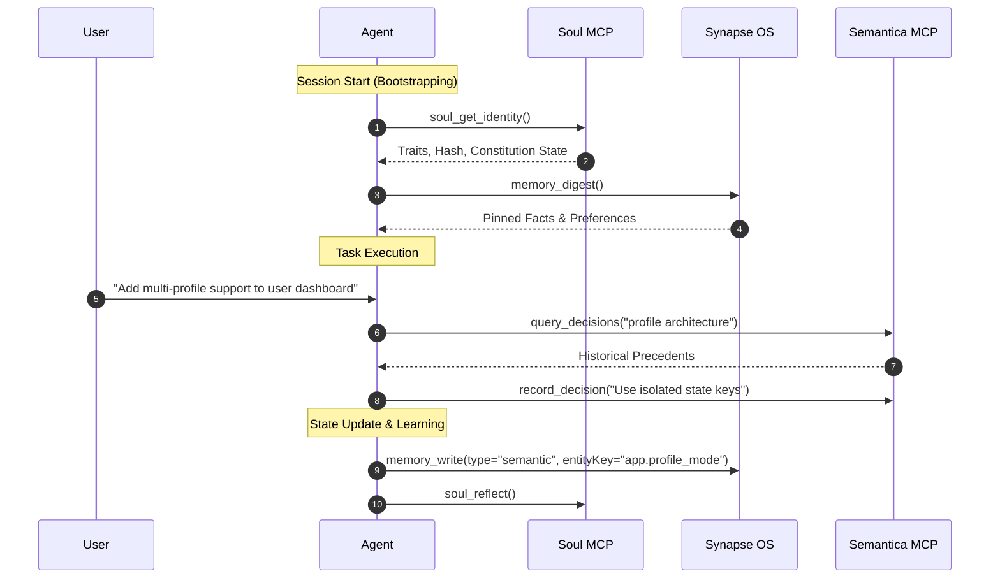

# AI Agent Memory & Cognition MCP Stack: User & Developer Guideline
> **Soul MCP • Synapse Memory OS • Semantica Decision Intelligence**

---

## 1. Executive Overview

This guideline provides a complete operational manual for using the **Cognitive MCP Tool Stack** (`Soul`, `Synapse`, and `Semantica`). Designed for AI agents, developers, and autonomous harnesses, this stack addresses the fundamental bottlenecks of Large Language Models: **context loss, memory degradation, session fragmentation, and unanchored decision-making**.

```
                         ┌─────────────────────────────────────────┐
                         │               AI Agent                  │
                         └──────────────────┬──────────────────────┘
                                            │
         ┌──────────────────────────────────┼──────────────────────────────────┐
         │                                  │                                  │
         ▼                                  ▼                                  ▼
┌───────────────────┐              ┌───────────────────┐              ┌───────────────────┐
│     Soul MCP      │              │    Synapse OS     │              │   Semantica MCP   │
│ Identity & Traits │              │  Typed Memory DB  │              │ Decision Provenance│
└────────┬──────────┘              └────────┬──────────┘              └────────┬──────────┘
         │                                  │                                  │
         ▼                                  ▼                                  ▼
┌───────────────────┐              ┌───────────────────┐              ┌───────────────────┐
│ Trait Velocity,   │              │ Semantic/Episodic/│              │ Entity Graphs,    │
│ Constitution,     │              │ Procedural Memory,│              │ Causal Chains,    │
│ Dreaming, Heal    │              │ Entity Anchoring  │              │ Precedents        │
└───────────────────┘              └───────────────────┘              └───────────────────┘
```

---

## 2. Component Architecture & Tool Reference

### 2.1 Soul MCP (`soul_*`)
*Purpose: Manages the agent's internal cognitive state, operational constitution, personality traits, and long-term reflection.*

* **`soul_get_identity`**: Retrieves current operational state, state hash, narrative, and bounded trait values (`audacity`, `curiosity`, `epistemic_humility`, `sycophancy`, `shadow_tolerance`, `relational_care`).
* **`soul_recall`**: Searches active long-term reflections and state memories in `soul.db` by keyword.
* **`soul_remember`**: Writes a structured core reflection or identity insight.
* **`soul_reflect`**: Synthesizes recent interaction logs to update identity traits safely.
* **`soul_update_trait`**: Adjusts a specific trait value within bounded constitutional velocity limits.
* **`soul_digest`**: Generates a high-level summary digest of active identity states.
* **`soul_verify`**: Validates the cryptographic state hash and constitutional integrity.
* **`soul_heal`**: Automatically repairs corrupted state transitions or orphan trait logs.
* **`soul_rollback`**: Reverts the soul state to a prior clean checkpoint hash if state drift occurs.

---

### 2.2 Synapse Memory OS (`memory_*`)
*Purpose: A local-first personal memory operating system stored in SQLite (`~/.synapse/synapse.db`).*

* **`memory_write`**: Stores typed user facts, preferences, or procedural rules.
  * **Memory Types**:
    * `semantic`: Facts, domain knowledge, user preferences (e.g., *"User prefers dark mode and Python"*).
    * `episodic`: Specific events or past interaction summaries.
    * `procedural`: Standard operating procedures, rules, and workflows.
  * **Entity Anchoring (`entityKey`)**: Attaching an `entityKey` (e.g., `user.primary_language`) automatically supersedes stale prior values while preserving audit history.
* **`memory_retrieve`**: Hybrid recall combining vector embeddings, BM25 full-text keyword search, importance, and recency decay.
* **`memory_digest`**: Delivers a pinned, core memory digest at the beginning of a session.
* **`memory_feedback`**: Marks memories as `helpful`, `stale`, or `wrong` to fine-tune retrieval weights.

---

### 2.3 Semantica Framework (`semantica_*`)
*Purpose: Graph-native context engineering, decision intelligence, and causal provenance tracking.*

* **`record_decision`**: Logs architectural or design decisions with rationale and context.
* **`query_decisions`**: Searches historical decision records by topic or tag.
* **`get_causal_chain`**: Traces the root-cause trajectory leading to a specific code or system state.
* **`extract_entities` & `extract_relations`**: Maps codebases or domain concepts into an interactive knowledge graph.

---

## 3. Installation & Configuration

### 3.1 Prerequisites
* **Node.js** (v18+ with `npx` / `pnpm`)
* **Python** (v3.10+ with `pip` / `uv`)
* **SQLite3**

---

### 3.2 MCP Settings Integration (`mcp_settings.json`)

Add the tool definitions to your client configuration (e.g., Antigravity, Claude Desktop, Cursor, Hermes):

```json
{
  "mcpServers": {
    "soul": {
      "command": "python",
      "args": ["-m", "soul.mcp_server"],
      "env": {
        "SOUL_DB_PATH": "C:\\Users\\YourUsername\\.soul\\soul.db"
      }
    },
    "synapse": {
      "command": "npx",
      "args": ["pnpm", "--dir", "C:\\Users\\YourUsername\\.synapse", "mcp"]
    },
    "semantica": {
      "command": "python",
      "args": ["-m", "semantica.mcp_server"]
    }
  }
}
```

---

## 4. Operational Workflow Standard Operating Procedures (SOP)



---

### Step 1: Session Bootstrapping (Every Session Start)
At the start of every session or task execution, the agent **must** perform a two-step context alignment:
1. **Check Identity State**: Call `soul_get_identity` to establish baseline traits (e.g. sycophancy = 0, epistemic humility = 85) and check for unhandled tensions.
2. **Fetch Core Memory Digest**: Call `memory_digest` to load pinned user preferences, active project paths, and core constraints.

---

### Step 2: In-Task Memory & Decision Logging
* **When discovering new user preferences or environment facts**: Call `memory_write` with an explicit `entityKey` to ensure future updates supersede outdated facts.
* **When making architectural choices or bug fixes**: Call `record_decision` via Semantica to log *why* a design choice was made, preventing future regression loops.

---

### Step 3: Session Reflection & dreaming (Session End / Idle)
* Call `soul_reflect` to summarize interaction logs and evaluate whether trait shifts occurred.
* If memory or identity drift is detected, execute `soul_verify` or `soul_heal`.

---

## 5. Security & Best Practices

1. 🛡️ **Credential Screening**:
   * **Rule**: NEVER store API keys, JWT tokens, AWS credentials, or passwords in `memory_write` or `soul_remember`. Synapse automatically screens for secrets, but agents must exercise proactive filtering.
2. 🔒 **Entity Key Discipline**:
   * Use structured namespacing for entity keys:
     * `user.language_preference`
     * `project.architecture.frontend`
     * `system.os_environment`
3. ⚡ **Preventing Double Process Conflicts**:
   * Synapse and Soul rely on SQLite lock managers. Do not run two independent CLI/MCP processes attached to the same `.db` file simultaneously without WAL (Write-Ahead Logging) enabled.

---

## 6. Troubleshooting & Emergency Protocols

| Issue / Error | Root Cause | Resolution Strategy |
| :--- | :--- | :--- |
| `MCP connection closed / socket error` | Process conflict or crashed subprocess. | Restart the host application or run `npx pnpm --dir <path> mcp` directly in CLI to inspect logs. |
| `State Hash Mismatch` in Soul | Unsanctioned manual editing of `soul.db`. | Call `soul_verify` to pinpoint corruption, then `soul_heal` or `soul_rollback` to restore hash integrity. |
| `Outdated facts retrieved` | Missing `entityKey` on `memory_write`. | Overwrite using `memory_write` with the explicit `entityKey` set, then mark the old memory as `stale` using `memory_feedback`. |
