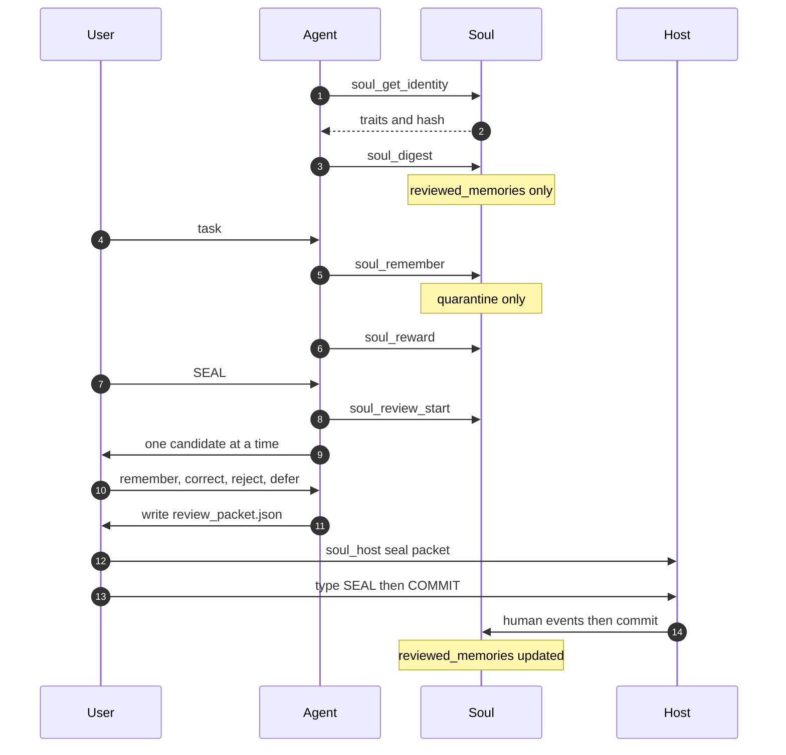

# Soul Engine MCP tool usage (v1.1.1)

This repo is **Soul only**: identity, quarantine, review, neuromodulators, SQLite. It is not Synapse or Semantica.

Long-term memory = **`reviewed_memories` after a human-origin commit**. `soul_remember` writes **quarantine** (`episodes`). Default `soul_recall` / `soul_digest` do not return unreviewed episodes.

---

## 1. Setup

* Python 3.9+ (no Node required)
* Same stdio server for every harness: `python -m soul_mcp_server` after `python install.py` or `pip install -e .`. Without that, point `args` at `soul_mcp_server.py` in the clone. Claude Desktop JSON first; Hermes YAML; Antigravity `~/.gemini/config/mcp_config.json`; Cursor, Pi, and any other client get the same `command` / `args` / `env`. `install.py` writes JSON MCP configs and copies `skills/soul-seal/SKILL.md` into Claude Code, Hermes, Antigravity, Cursor, Pi, and `~/.agents/skills` on the machine that runs the installer. MCP `instructions` cover hosts with no skill dirs.

```json
{
  "mcpServers": {
    "soul": {
      "command": "python",
      "args": ["-m", "soul_mcp_server"],
      "env": {
        "SOUL_DB_PATH": "/home/you/.soul/soul.db"
      }
    }
  }
}
```

Windows: `py -3 -m soul_mcp_server` is equivalent. After `pip install -e .`, `soul-mcp` and `soul-host` are on PATH.

Hermes (`~/.hermes/config.yaml`):

```yaml
mcp_servers:
  soul:
    command: "python"
    args: ["-m", "soul_mcp_server"]
    env:
      SOUL_DB_PATH: "/home/you/.soul/soul.db"
```

---

## 2. The 20 MCP tools

### Identity and homeostasis

* **`soul_get_identity`**: Traits, neuromodulators, narrative, tensions, state hash.
* **`soul_recall`**: Search **reviewed** memory (FTS5 + hashing/dense fallback).
* **`soul_remember`**: Quarantine an episode (secret scrub). Not default recall until review commit.
* **`soul_digest`**: Traits + neuromodulators + reviewed facts for a prompt.
* **`soul_verify`**: Token-overlap NLI + epistemic rank against stored claims (not a constitution-hash checker).
* **`soul_reflect`**: Interpret unresolved tensions. Does not commit identity facts.
* **`soul_dream`**: Counterfactual, provenance `imagined`. Ordinary review cannot turn a dream into fact.
* **`soul_update_trait`**: Bounded traits. MCP cannot set `is_human_approved`.
* **`soul_reward`**: `valence` ∈ [-1, 1] → dopamine/cortisol in `neuromodulators`. Serotonin is `1 - max(DA, cortisol)`.
* **`soul_heal` / `soul_rollback`**: Identity repair/rollback. MCP requires `human_event_ref` with `origin_kind=human`.
* **`soul_daemon_status`**: Background worker counters.

### Review (8 tools)

* **`soul_host_event`**: Hash-chained host event. MCP **never** persists `origin_kind=human` (coerced to `agent`).
* **`soul_review_start`**: Open/reuse cycle, extract candidates (`session_id`, `trigger_kind=explicit` when the human types SEAL).
* **`soul_review_status`**: Latest cycle and pending candidates.
* **`soul_review_stage_decision`**: `candidate_id`, `decision`, `human_event_ref` (must already be origin `human`).
* **`soul_review_preview`**: Canonical preview + hash.
* **`soul_review_commit`**: Universal harness commit API. Needs `commit_human_event_ref` origin `human`.
* **`soul_memory_rollback` / `soul_memory_delete`**: Forward-only set rollback / salted delete. Human event required.

Decisions: `remember`, `correct`, `session_only`, `reject`, `defer`, plus contradiction set `replace_old`, `keep_both_with_context`, `keep_old`, `reject_both`.

---

## 3. Workflow



Human origin is tty `soul_host` only. MCP `soul_review_commit` is the same tool in every harness; it needs the human row `soul_host` SEAL minted. Model-minted `soul_host_event` ids fail.

---

### Step 1: Session start

`soul_get_identity` then `soul_digest`. Do not expect this chat’s `soul_remember` calls to appear until after commit.

### Step 2: During the task

`soul_remember` to quarantine. `soul_reward` on real success/failure. `soul_reflect` / `soul_dream` to think — not to author identity.

### Step 3: Human review

Type **SEAL** in the agent chat (every harness). Interview → `review_packet.json` → **your** terminal `SEAL` then `COMMIT` (`py -3 -m soul_host seal review_packet.json`). The agent must not run `soul_host`.

---

## 4. Security

Do not put API keys in memory. MCP cannot self-attest human origin. Heal/rollback/commit/delete require a kernel-recorded `origin_kind=human` row.

---

## 5. Troubleshooting

| Issue | Cause | Fix |
| :--- | :--- | :--- |
| MCP process dies | Subprocess crash | Restart host; run `python -m soul_mcp_server` in a terminal |
| Stage/commit: not human | MCP `soul_host_event` is origin `agent` | `py -3 -m soul_host seal review_packet.json` — type **SEAL** then **COMMIT** |
| Recall empty after remember | Quarantine ≠ long-term | Finish review commit |
| Goose `config.yaml` unchanged | Installer writes JSON only | Skip YAML; point Goose at a JSON MCP file |
