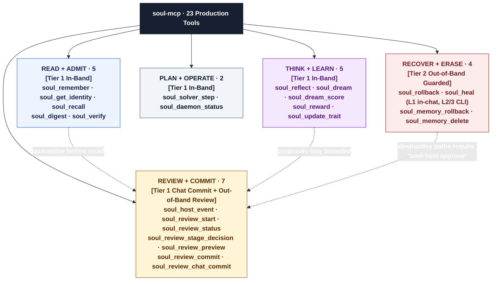
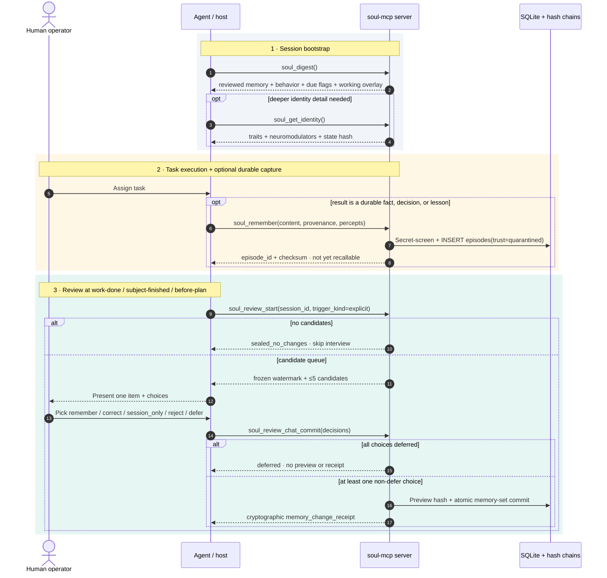

# Soul Engine MCP tool usage (v1.2.0)

This repo is **Soul only**: identity, quarantine, review, neuromodulators, SQLite. It is not Synapse or Semantica.

Long-term memory = **`reviewed_memories` after a human-origin commit**. `soul_remember` writes **quarantine** (`episodes`). Default `soul_recall` / `soul_digest` do not return unreviewed episodes.

---

## 1. Setup

* Python 3.10+ (no Node required)
* Same stdio server for every harness: `python -m soul_mcp_server` after `python install.py` or `pip install -e .`. Without that, point `args` at `soul_mcp_server.py` in the clone. Claude Desktop JSON first; Hermes YAML; Antigravity `~/.gemini/config/mcp_config.json`; Cursor, Pi, and any other client get the same `command` / `args` / `env`. `install.py` writes JSON MCP configs and copies `skills/soul-seal/SKILL.md` and `skills/seacom/SKILL.md` into Claude Code, Hermes, Antigravity, Cursor, Pi, and `~/.agents/skills` on the machine that runs the installer. MCP `instructions` cover hosts with no skill dirs.

```json
{
  "mcpServers": {
    "soul": {
      "command": "python",
      "args": ["-m", "soul_mcp_server"],
      "env": {
        "SOUL_DB_PATH": "/home/you/.soul/soul.db"
      }
    }
  }
}
```

Windows: `py -3 -m soul_mcp_server` is equivalent. After `pip install -e .`, `soul-mcp` and `soul-host` are on PATH.

Hermes (`~/.hermes/config.yaml`):

```yaml
mcp_servers:
  soul:
    command: "python"
    args: ["-m", "soul_mcp_server"]
    env:
      SOUL_DB_PATH: "/home/you/.soul/soul.db"
```

---

## 2. The 23 MCP tools



### Identity and homeostasis (14 tools)

* **`soul_get_identity`**: Traits, neuromodulators, narrative, tensions, state hash.
* **`soul_recall`**: Search **reviewed** memory (FTS5 + hashing/dense fallback).
* **`soul_remember`**: Quarantine an episode (secret scrub). Optional percept fields: `occurred_at`, `source_ref`, `medium`, `privacy_class`, `content_ref`, `percept_json`. Not default recall until review commit. Percepts stay quarantined until SEAL.
* **`soul_digest`**: Session start: traits, `behavior` orders, due flags (`dream_due`, `heal_due`, `remember_due`, `solver_active`), `health` self-report (cannot authorize), `dead_end` packet, newest reviewed facts, `working` solver traces (not facts), `last_imagined`. Follow `behavior`.
* **`soul_verify`**: Token-overlap NLI + epistemic rank against stored claims (not a constitution-hash checker).
* **`soul_reflect`**: Empty if no tensions. First call returns evidence; second stores agent interpretations. Does not commit identity.
* **`soul_dream`**: First call is a context packet (`needs_thought`: `narrative`, `load_bearing`, `analogical_cases`). Second records ≥2 imagined outcomes (strings or branch objects; branch objects may carry signed `likelihood` in [-1,1]). Provenance `imagined`.
* **`soul_dream_score`** *(new in 1.2.0)*: Scores pending imagined branches against the realized outcome (`dream_rpe = realized − predicted`). Updates per-context **dream trust** only — imagined content never writes expectations directly. Trust scales the learning rate on *real* outcomes (0.5×–1.0×). Auto-fires on negative receipted external tests.
* **`soul_solver_step`**: Receipted fail/succeed/dead_end. Working buffer + session overlay keyed by `plan_id`+`agent_id`. `close_plan=true` quarantines a compact per-agent trace, then drops that plan's overlay in one SQLite txn. Not identity, not per-step episodes. Not `soul_remember`. Refuses if this `session_id` still has pending review candidates.
* **`soul_update_trait`**: Bounded traits. Autonomous writes need ≥2 `evidence_refs`, per-event `|Δ|` ≤ 10, 7-day `|Δ|` sum ≤ 30. MCP cannot set `is_human_approved`.
* **`soul_reward`**: Identity wallet only for `external_test` + `evidence_receipt` or `external_human` + this chat `session_id` + `review_receipt` from a committed output review. `internal_reflection` / `internal_dream` are in-plan self-score: overlay only, requires `plan_id` or a live solver overlay — idle internal is refused. `valence` ∈ [-1, 1] → dopamine/cortisol on the active wallet. Serotonin is `1 - max(DA, cortisol)`.
* **`soul_heal` / `soul_rollback`**: Identity repair/rollback. Level 1 routine homeostasis recalibration is allowed in-chat. Destructive operations (rollback, Level 2/3 heal) require out-of-band operator commands (`soul-host approve rollback-identity <version>`, `soul-host approve heal <level>`).
* **`soul_daemon_status`**: Background worker counters and homeostatic decay status.

### Review and Governance (9 tools)

* **`soul_host_event`**: Hash-chained host event. MCP **never** persists `origin_kind=human` (coerced to `agent`).
* **`soul_review_start`**: Open/reuse cycle, extract candidates (`session_id`, `trigger_kind=explicit`). Call when a subject is finished, when a piece of work is done, and before starting a plan if quarantine is non-empty; also when the human types SEAL or `/seacom`. Interview is not a commit.
* **`soul_review_status`**: Latest cycle and pending candidates.
* **`soul_review_stage_decision`**: `candidate_id`, `decision`, `human_event_ref` (must already be origin `human`).
* **`soul_review_preview`**: Canonical preview + hash.
* **`soul_review_commit`**: Promote batch; `commit_human_event_ref` origin `human` (tty/`soul_host` path).
* **`soul_review_chat_commit`**: After this run’s Review plan picks (remember / correct / session_only / reject), promote — same as **`/seacom`** / COMMIT. Start-cycle is not a commit. `defer` is not approval. Not idle/bye.
* **`soul_memory_rollback` / `soul_memory_delete`**: Forward-only set rollback / salted delete. Destructive operations requiring out-of-band operator authorization via `soul-host approve rollback-memory <version>` / `soul-host approve delete-memory <memory_id>`.

Decisions: `remember`, `correct`, `session_only`, `reject`, `defer`, plus contradiction set `replace_old`, `keep_both_with_context`, `keep_old`, `reject_both`.

---

## 3. Workflow



Human origin for **chat COMMIT** is `soul_review_chat_commit` after this run’s Review plan picks. `soul_host_event` still cannot mint `human`. Optional tty: `soul_host` SEAL then COMMIT.

---

### Step 1: Session start

`soul_digest` first. Follow `digest.behavior`. `soul_get_identity` is optional extra detail. Do not expect this chat’s `soul_remember` calls to appear until after commit. If `dream_due` / `reflect_due`, think with those tools — they do not author identity.

### Step 2: During the task

`soul_remember` to quarantine. `soul_solver_step` for receipted fail/succeed/dead_end during a plan — not `soul_reward`. `soul_reward` only after a human-accepted test receipt or with this chat `session_id`. If `heal_due`, wait for HEAL then `soul_heal` with `session_id`. `soul_reflect` / `soul_dream` to think — not to author identity.

### Step 3: Human review

The agent starts the **interview** when a subject is finished, when a piece of work is done, and before starting a plan, if quarantine is non-empty (`soul_review_start`). Show a **Review plan**: numbered queue plus several options (remember / correct / session_only / reject / defer). 0 candidates → skip the interview. Starting the cycle is not a commit.

When they **pick** (remember / correct / session_only / reject, or a contradiction set), that **is** approval: `soul_review_chat_commit` after this run’s picks. `defer` is not approval. **`/seacom`** remains the explicit slash for leftover pending items.

---

## 4. Security

Do not put API keys in memory. `soul_host_event` cannot mint `origin_kind=human`. Chat tools (`soul_review_chat_commit`) mint human origin in-kernel for reviewed candidates; skills and instructions are the gate. Tier-2 destructive operations (identity rollback, Level 2/3 heal, memory rollback, memory deletion) cannot be invoked by models directly and require explicit out-of-band operator commands (`soul-host approve ...`).

---

## 5. Troubleshooting

| Issue | Cause | Fix |
| :--- | :--- | :--- |
| MCP process dies | Subprocess crash | Restart host; run `python -m soul_mcp_server` in a terminal |
| Stage/commit: not human | MCP `soul_host_event` is origin `agent` | Pick on the Review plan, or type **`/seacom`**, then `soul_review_chat_commit`. Optional tty: `soul-host approve` |
| Recall empty after remember | Quarantine ≠ long-term | Finish review commit |
| Goose `config.yaml` unchanged | Installer writes JSON only | Skip YAML; point Goose at a JSON MCP file |
