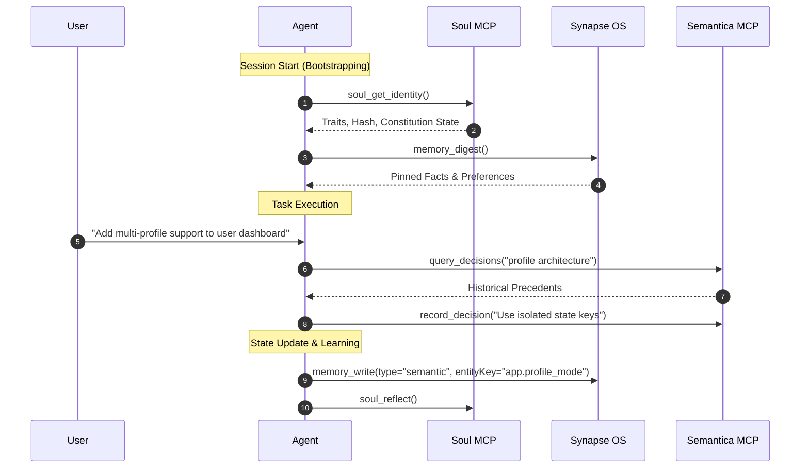

# AI agent memory and cognition MCP stack: integration guide
> **Soul MCP • Synapse Memory OS • Semantica Decision Intelligence**

---

## 1. System overview

This guide documents the operational setup for the cognitive MCP tool stack (`Soul`, `Synapse`, and `Semantica`). The stack gives agents structured long-term memory, identity governance, and decision provenance tracking.

```
                         ┌─────────────────────────────────────────┐
                         │               AI Agent                  │
                         └──────────────────┬──────────────────────┘
                                            │
         ┌──────────────────────────────────┼──────────────────────────────────┐
         │                                  │                                  │
         ▼                                  ▼                                  ▼
┌───────────────────┐              ┌───────────────────┐              ┌───────────────────┐
│     Soul MCP      │              │    Synapse OS     │              │   Semantica MCP   │
│ Identity & Traits │              │  Typed Memory DB  │              │ Decision Provenance│
└────────┬──────────┘              └────────┬──────────┘              └────────┬──────────┘
         │                                  │                                  │
         ▼                                  ▼                                  ▼
┌───────────────────┐              ┌───────────────────┐              ┌───────────────────┐
│ Trait Velocity,   │              │ Semantic/Episodic/│              │ Entity Graphs,    │
│ Constitution,     │              │ Procedural Memory,│              │ Causal Chains,    │
│ Dreaming, Heal    │              │ Entity Anchoring  │              │ Precedents        │
└───────────────────┘              └───────────────────┘              └───────────────────┘
```

---

## 2. Component architecture and tool reference

### 2.1 Soul MCP (`soul_*`)
Manages internal cognitive state, operational constitution, personality traits, long-term reflection, and human-in-the-loop review cycles.

#### Core Identity & Homeostasis Tools
* **`soul_get_identity`**: Retrieves current operational state, state hash, narrative, and bounded trait values (`audacity`, `curiosity`, `epistemic_humility`, `sycophancy`, `shadow_tolerance`, `relational_care`).
* **`soul_recall`**: Searches active long-term reflections and state memories in `soul.db` by keyword or hybrid fusion.
* **`soul_remember`**: Writes a structured core reflection or identity insight.
* **`soul_reflect`**: Synthesizes recent interaction logs to update identity traits safely.
* **`soul_update_trait`**: Adjusts a specific trait value within bounded constitutional limits.
* **`soul_digest`**: Generates a high-level summary digest of active identity states.
* **`soul_verify`**: Validates the cryptographic state hash and constitutional integrity.
* **`soul_heal`**: Repairs corrupted state transitions or orphan trait logs.
* **`soul_rollback`**: Reverts the soul state to a prior checkpoint hash if state drift occurs.
* **`soul_dream`**: Runs offline counterfactual memory consolidation and dream simulations.
* **`soul_reward`**: Adjusts bio-neuromodulatory neurotransmitters (Dopamine, Cortisol, Serotonin).
* **`soul_daemon_status`**: Queries background daemon worker status and maintenance heartbeat.

#### Human Review Cycle Governance Tools (v1.1.0)
* **`soul_host_event`**: Ingests tamper-evident user/system host events into the SHA-256 hash chain.
* **`soul_review_start`**: Opens an anchored review cycle with watermark state snapshots.
* **`soul_review_status`**: Retrieves real-time lifecycle phase, candidate extractions, and candidate decisions.
* **`soul_review_stage_decision`**: Stages human-authorized decisions (`remember`, `correct`, `reject`, `replace_old`, `session_only`).
* **`soul_review_preview`**: Generates pre-commit diffs, state hash previews, and change summaries.
* **`soul_review_commit`**: Cryptographically commits memory promotions and generates tamper-evident receipts.
* **`soul_memory_rollback`**: Performs forward-only rollbacks to prior memory set versions ($V \to V+1$).
* **`soul_memory_delete`**: Executes GDPR salted privacy erasure cascades and nullifies memory salts.

---

### 2.2 Synapse Memory OS (`memory_*`)
Local-first memory operating system stored in SQLite (`~/.synapse/synapse.db`).

* **`memory_write`**: Stores typed user facts, preferences, or procedural rules.
  * **Memory types**:
    * `semantic`: Facts, domain knowledge, user preferences (e.g., *"User prefers dark mode and Python"*).
    * `episodic`: Specific events or past interaction summaries.
    * `procedural`: Standard operating procedures, rules, and workflows.
  * **Entity anchoring (`entityKey`)**: Attaching an `entityKey` (such as `user.primary_language`) automatically supersedes stale prior values while preserving audit history.
* **`memory_retrieve`**: Hybrid recall combining vector embeddings, BM25 full-text keyword search, importance, and recency decay.
* **`memory_digest`**: Delivers a pinned, core memory digest at the beginning of a session.
* **`memory_feedback`**: Marks memories as `helpful`, `stale`, or `wrong` to adjust retrieval weights.

---

### 2.3 Semantica framework (`semantica_*`)
Graph-native context engineering, decision intelligence, and causal provenance tracking.

* **`record_decision`**: Logs architectural or design decisions with rationale and context.
* **`query_decisions`**: Searches historical decision records by topic or tag.
* **`get_causal_chain`**: Traces the causal sequence leading to a specific code or system state.
* **`extract_entities` & `extract_relations`**: Maps codebases or domain concepts into a knowledge graph.

---

## 3. Installation and configuration

### 3.1 Prerequisites
* Node.js (v18+ with `npx` / `pnpm`)
* Python (v3.10+ with `pip` / `uv`)
* SQLite3

---

### 3.2 MCP settings configuration (`mcp_settings.json`)

Add the tool definitions to your client configuration:

```json
{
  "mcpServers": {
    "soul": {
      "command": "python",
      "args": ["-m", "soul.mcp_server"],
      "env": {
        "SOUL_DB_PATH": "C:\\Users\\YourUsername\\.soul\\soul.db"
      }
    },
    "synapse": {
      "command": "npx",
      "args": ["pnpm", "--dir", "C:\\Users\\YourUsername\\.synapse", "mcp"]
    },
    "semantica": {
      "command": "python",
      "args": ["-m", "semantica.mcp_server"]
    }
  }
}
```

---

## 4. Operational workflow



---

### Step 1: Session bootstrapping
At the start of a session, perform two initial calls:
1. **Check identity state**: Call `soul_get_identity` to establish baseline traits and inspect unhandled tensions.
2. **Fetch core memory digest**: Call `memory_digest` to load pinned user preferences and project constraints.

---

### Step 2: In-task memory and decision logging
* When discovering new preferences or environment facts, call `memory_write` with an explicit `entityKey` so updates supersede older facts.
* When choosing an architectural direction or bug fix, call `record_decision` via Semantica to record the technical rationale.

---

### Step 3: Session reflection and consolidation
* Call `soul_reflect` to summarize interaction logs and evaluate trait adjustments.
* If memory or identity drift is detected, run `soul_verify` or `soul_heal`.

---

## 5. Operational guidelines and security

1. **Credential screening**:
   Do not store API keys, tokens, or passwords in memory. Synapse and Soul automatically screen for common secret patterns, but callers should avoid passing sensitive credentials.
2. **Entity key namespacing**:
   Use structured hierarchies for entity keys:
   * `user.language_preference`
   * `project.architecture.frontend`
   * `system.os_environment`
3. **Database concurrency**:
   Synapse and Soul run on SQLite with WAL (Write-Ahead Logging) enabled for safe concurrent reads and writes. Avoid bypassing the MCP server to edit `.db` files directly during execution.

---

## 6. Troubleshooting

| Issue | Root Cause | Resolution |
| :--- | :--- | :--- |
| `MCP connection closed / socket error` | Process conflict or crashed subprocess. | Restart the host application or test the command directly in the terminal to inspect logs. |
| `State Hash Mismatch` in Soul | Manual direct edits to `soul.db`. | Call `soul_verify` to pinpoint corruption, then `soul_heal` or `soul_rollback` to restore hash integrity. |
| `Outdated facts retrieved` | Missing `entityKey` on `memory_write`. | Overwrite using `memory_write` with the explicit `entityKey` set, then mark the old memory as `stale` using `memory_feedback`. |
