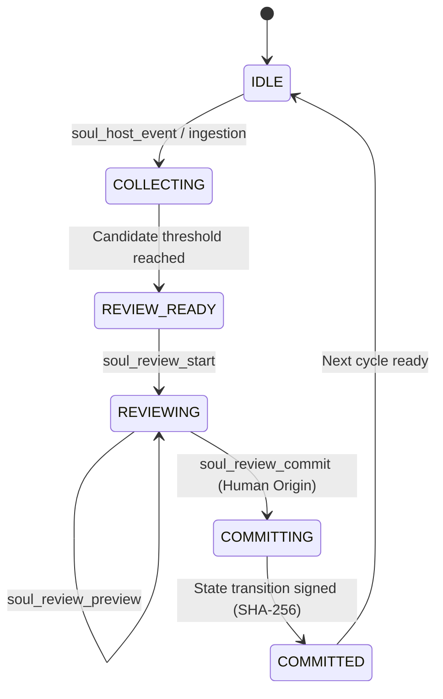

# Soul Review Cycle Technical Specification (v1.1.0)

**Normative source:** [CONSTITUTION.md](./CONSTITUTION.md) • [ARCHITECTURE.md](./ARCHITECTURE.md)  
**Standard:** ISO/IEC/IEEE 29119 Industrial Grade Verification  
**Status:** Implemented & Verified in `soul_review.py`

---

## 1. Executive Summary

Soul Engine v1.1.0 introduces the **Soul Review Cycle**, a cryptographic human-in-the-loop memory governance subsystem. While v1.0.0 established the local bio-homeostatic cognitive kernel and epistemic authority ranking, v1.1.0 introduces strict lifecycle controls over how episodic and semantic experiences transition from raw interaction logs to permanent, active memory representations.



---

## 2. Core Architectural Pillars

The Review Cycle is governed by four cryptographic and operational invariants:

### 2.1 Watermark State Isolation & Snapshotting
When a review cycle opens via `soul_review_start`, the engine records the exact `start_watermark_event_id` and captures a pre-state snapshot ($S_{\text{start}}$). Any host events ingested while the review is active are partitioned into the subsequent cycle, preventing race conditions or concurrent state contamination.

### 2.2 Five Discrete Review Decisions
For each candidate memory extraction, the human reviewer stages one of five deterministic actions:

| Decision Action | Semantics & State Effect | Authority Requirement |
| :--- | :--- | :---: |
| **`remember`** | Promotes candidate to active memory ($M_{\text{active}}$) with specified epistemic rank (`verified`, `observed`, etc.). | Human origin |
| **`correct`** | Overrides proposed content with human-edited canonical text before promotion. | Human origin |
| **`reject`** | Drops candidate permanently; marks extraction as rejected in audit ledger. | Human origin |
| **`replace_old`** | Atomically supersedes target prior memory ID with new verified content. | Human origin |
| **`session_only`** | Retains memory strictly for session scratch context without long-term database persistence. | Human origin |

### 2.3 Deterministic Pre-Commit Diffs & Hash Previews
Before executing a state transition, `soul_review_preview` computes:
1. Exact unified text diffs ($\Delta_{\text{memories}}$).
2. Trait and emotional delta vectors ($\Delta_{\text{traits}}$).
3. Simulated post-commit state hash ($H_{\text{preview}} = \text{SHA-256}(S_{\text{prev}} \parallel \Delta \parallel \text{receipt})$).

### 2.4 Cryptographic Commit Receipts & Tamper-Evidence
Upon calling `soul_review_commit`, the engine executes an atomic SQLite transaction:
- Validates that `origin_kind == "human"` (Rule 1 / FR-1).
- Increments memory set version ($V \to V+1$).
- Calculates root Merkle hash of all active memories.
- Issues an immutable receipt with timestamp, author, item count, and commit hash.

---

## 3. Database Schema (SQLite WAL)

The Review Cycle is backed by 5 dedicated tables in `soul.db`:

```sql
-- 1. Ingested host events
CREATE TABLE IF NOT EXISTS host_events (
    event_id TEXT PRIMARY KEY,
    session_id TEXT NOT NULL,
    event_type TEXT NOT NULL,
    payload_json TEXT NOT NULL,
    created_at TEXT NOT NULL,
    watermark_committed INTEGER DEFAULT 0
);

-- 2. Review cycle sessions
CREATE TABLE IF NOT EXISTS review_cycles (
    cycle_id TEXT PRIMARY KEY,
    session_id TEXT NOT NULL,
    status TEXT NOT NULL, -- 'collecting', 'review_ready', 'reviewing', 'committing', 'committed', 'aborted'
    start_watermark_event_id TEXT,
    end_watermark_event_id TEXT,
    pre_state_hash TEXT NOT NULL,
    post_state_hash TEXT,
    created_at TEXT NOT NULL,
    closed_at TEXT
);

-- 3. Extracted candidate memories
CREATE TABLE IF NOT EXISTS candidate_extractions (
    extraction_id TEXT PRIMARY KEY,
    cycle_id TEXT NOT NULL,
    source_event_id TEXT,
    raw_content TEXT NOT NULL,
    suggested_rank TEXT NOT NULL,
    suggested_category TEXT NOT NULL,
    confidence REAL NOT NULL,
    created_at TEXT NOT NULL,
    FOREIGN KEY(cycle_id) REFERENCES review_cycles(cycle_id)
);

-- 4. Staged review decisions
CREATE TABLE IF NOT EXISTS staged_review_decisions (
    decision_id TEXT PRIMARY KEY,
    cycle_id TEXT NOT NULL,
    extraction_id TEXT NOT NULL,
    action TEXT NOT NULL, -- 'remember', 'correct', 'reject', 'replace_old', 'session_only'
    edited_content TEXT,
    target_memory_id TEXT,
    staged_by_origin TEXT NOT NULL, -- Must be 'human'
    staged_at TEXT NOT NULL,
    FOREIGN KEY(cycle_id) REFERENCES review_cycles(cycle_id)
);

-- 5. Reviewed active memories
CREATE TABLE IF NOT EXISTS reviewed_memories (
    memory_id TEXT PRIMARY KEY,
    cycle_id TEXT NOT NULL,
    memory_set_version INTEGER NOT NULL,
    canonical_text TEXT NOT NULL,
    epistemic_rank TEXT NOT NULL,
    category TEXT NOT NULL,
    content_hash TEXT NOT NULL,
    content_hash_salt TEXT,
    status TEXT NOT NULL, -- 'active', 'superseded', 'deleted'
    created_at TEXT NOT NULL,
    superseded_by TEXT
);
```

---

## 4. MCP Review Tools Reference (8 Tools)

| Tool Name | Parameters | Description |
| :--- | :--- | :--- |
| **`soul_host_event`** | `session_id`, `event_type`, `payload` | Ingests raw interaction event into the tamper-evident hash chain. |
| **`soul_review_start`** | `session_id`, `scope_key` | Initiates a review session and freezes start watermark. |
| **`soul_review_status`** | `cycle_id` | Returns active cycle state, candidate extractions, and staged decisions. |
| **`soul_review_stage_decision`** | `cycle_id`, `extraction_id`, `action`, `edited_content`, `target_memory_id`, `origin_kind` | Stages a human-authorized decision. Fails if `origin_kind != "human"`. |
| **`soul_review_preview`** | `cycle_id` | Generates text diffs and simulated post-commit state hash. |
| **`soul_review_commit`** | `cycle_id`, `origin_kind`, `reviewer_notes` | Atomically commits staged decisions and increments memory set version. |
| **`soul_memory_rollback`** | `target_version`, `reason`, `origin_kind` | Performs forward-only rollback to prior memory set version ($V \to V+1$). |
| **`soul_memory_delete`** | `memory_id`, `reason`, `origin_kind` | Executes GDPR salted erasure cascade (nullifies salt and redacts text). |

---

## 5. Security & Invariant Defenses

1. **Rule 1 / FR-1 Invariant (Human Origin):**
   Agent prompts or automated tools attempting to stage decisions with `origin_kind="agent"` or `origin_kind="ai"` are immediately rejected with an `UNAUTHORIZED_ORIGIN` exception.
2. **Quarantine Isolation (FR-27):**
   Unreviewed raw experiences remain quarantined in `candidate_extractions` and are never surfaced in standard `soul_recall` queries.
3. **GDPR Salted Erasure (FR-32):**
   When `soul_memory_delete` is invoked, the memory's `content_hash_salt` is wiped (`NULL`) and `canonical_text` is replaced with `[REDACTED]`. Because SHA-256 is one-way, prior hashes cannot be inverted to recover deleted personal data.
