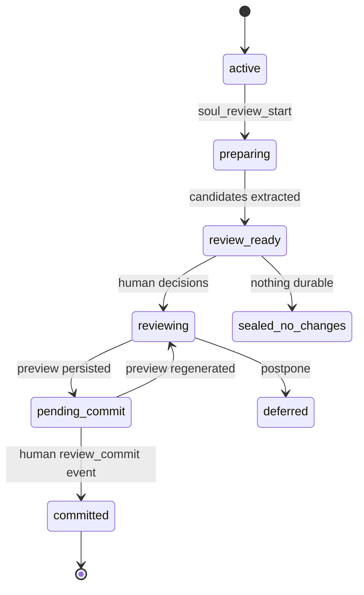

# Soul Review Cycle (implemented v1.1.1)

**Normative source:** [CONSTITUTION.md](./CONSTITUTION.md) • [ARCHITECTURE.md](./ARCHITECTURE.md)  
**Code:** `soul_review.py`, `soul_kernel.py`, `soul_host.py`, MCP tools in `soul_mcp_server.py`  
**Schema:** `SCHEMA_VERSION = 7` (`host_events`, `review_cycles`, `memory_candidates`, `review_decisions`, `reviewed_memories`, `memory_set_versions`, `memory_set_members`, `neuromodulators`, …)

Long-term / default recall = **`reviewed_memories` after commit**. Raw ingest stays in **`episodes`** (quarantine).

---

## 1. Pipeline

```text
conversation / soul_remember
→ quarantined episodes
→ soul_review_start (watermark + extract)
→ human types SEAL in any MCP chat (interview)
→ human-origin decision events
→ exact preview
→ separate human-origin commit
→ reviewed_memories + receipt
```

A review cycle is not a chat session. Idle, “bye”, and the model must not commit. The human types **SEAL** in the agent chat; the agent writes `review_packet.json`; commit is `soul_host` (type `SEAL` then `COMMIT`). Same on every harness.



---

## 2. Invariants

1. **Watermark.** `soul_review_start` freezes the host-event watermark. Extract only through that point.
2. **Decisions** (normal): `remember`, `correct`, `session_only`, `reject`, `defer`.  
   Contradiction: `replace_old`, `keep_both_with_context`, `keep_old`, `reject_both`, `defer`.  
   Human confirm means “store this representation,” **not** “this is objectively verified.”
3. **Preview** then **commit**. Prior “remember” answers are not enough. `soul_host`: type `SEAL` (one human event per decision) then `COMMIT` (commit event bound to preview).
4. **MCP** `soul_review_commit` is the same tool in every harness. It requires `origin_kind=human`. That row comes from `soul_host` SEAL, not from MCP `soul_host_event`.

---

## 3. Schema note

Do **not** copy the historical SQL below as a migration. Live DDL is in `soul_kernel.py`. Quarantine lives in `episodes`, not `candidate_extractions`. Candidates are `memory_candidates`.

<details>
<summary>Historical illustrative SQL (not implemented as written)</summary>

```sql
-- names and columns here are a draft picture, not SCHEMA_VERSION 7
CREATE TABLE host_events (...);
CREATE TABLE review_cycles (...);
CREATE TABLE candidate_extractions (...);
```

</details>

---

## 4. MCP review tools

| Tool | What it does |
| :--- | :--- |
| `soul_host_event` | Chain an event. Origin never `human` on MCP. |
| `soul_review_start` | Open cycle, extract candidates (`session_id`, `trigger_kind`). |
| `soul_review_status` | Pending candidates / preview hash. |
| `soul_review_stage_decision` | Stage one decision; `human_event_ref` must be origin `human`. |
| `soul_review_preview` | Persist preview hash. |
| `soul_review_commit` | Promote batch; `commit_human_event_ref` origin `human`. |
| `soul_memory_rollback` | Forward-only memory-set version copy. |
| `soul_memory_delete` | Salted deletion cascade. |

---

## 5. Defenses

1. **Human origin.** Packet → `py -3 -m soul_host seal review_packet.json` → type **SEAL** then **COMMIT**. MCP `soul_review_commit` uses that human row; it cannot mint one.
2. **Quarantine.** Unreviewed `episodes` are omitted from default `soul_recall` / `soul_digest`.
3. **Deletion.** `soul_memory_delete` redacts text and erases salts; versions move forward only.
