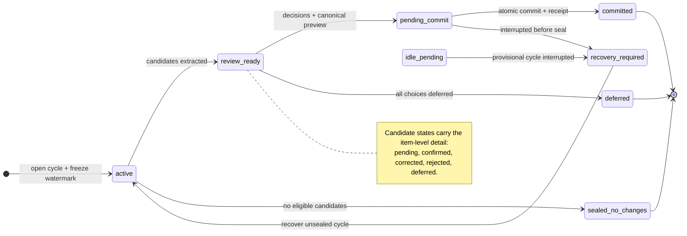

# Soul Review Cycle (implemented v1.2.0)

**Normative source:** [CONSTITUTION.md](./CONSTITUTION.md) • [ARCHITECTURE.md](./ARCHITECTURE.md)  
**Code:** `soul_review.py`, `soul_kernel.py`, `soul_host.py`, MCP tools in `soul_mcp_server.py`  
**Schema:** `SCHEMA_VERSION = 9` (`host_events`, `review_cycles`, `memory_candidates`, `review_decisions`, `reviewed_memories`, `memory_set_versions`, `memory_set_members`, `neuromodulators`, `daemon_flags`, `trait_drift_log`, `episodes.retention_until`, …)

Long-term / default recall = **`reviewed_memories` after commit**. Raw ingest stays in **`episodes`** (quarantine).

---

## 1. Pipeline

| Stage | Persisted effect | User-visible effect |
| :--- | :--- | :--- |
| **Capture** | `soul_remember` inserts a quarantined `episodes` row | Nothing enters default recall |
| **Open** | `soul_review_start` freezes the host-event watermark and extracts up to five candidates | Empty queue skips the interview |
| **Choose** | Human picks `remember`, `correct`, `session_only`, `reject`, or `defer` | One Review-plan item at a time |
| **Commit** | Any non-defer picks trigger preview validation and `soul_review_chat_commit` | New memory-set version + receipt |
| **Defer** | All-defer input leaves candidates for later | No preview, promotion, or receipt |

A review cycle is not a chat session. Idle, “bye”, and the model must not commit. **Start interview** ≠ **promote**. Breakpoints open a **Review plan**; they do not write `reviewed_memories`. Completing this run’s picks **is** the commit (`soul_review_chat_commit`), same as **`/seacom`** / COMMIT. `defer` is not approval. **`/seacom`** remains the explicit slash for leftover pending. Optional tty: `soul_host` (type `SEAL` then `COMMIT`). Same on every harness. Note that Tier-2 destructive operations (identity rollback, level 2/3 heal, memory rollback, memory deletion) require out-of-band authorization via `soul-host` CLI commands and cannot be executed via chat.



---

## 2. Invariants

1. **Watermark.** `soul_review_start` freezes the host-event watermark. Extract only through that point.
2. **Decisions** (normal): `remember`, `correct`, `session_only`, `reject`, `defer`.  
   Contradiction: `replace_old`, `keep_both_with_context`, `keep_old`, `reject_both`, `defer`.  
   Human confirm means “store this representation,” **not** “this is objectively verified.”
3. **Preview** then **commit**. Starting the cycle is not enough. Chat promote: this run’s Review plan picks, or **`/seacom`** / COMMIT for leftover pending (`soul_review_chat_commit`). Optional tty: `soul_host` type `SEAL` (one human event per decision) then `COMMIT` (commit event bound to preview).
4. **MCP** `soul_review_commit` still requires `origin_kind=human`. Chat COMMIT is `soul_review_chat_commit` after the interview (instruction-gated). `soul_host_event` cannot mint a human row.

---

## 3. Schema note

Do **not** copy the historical SQL below as a migration. Live DDL is in `soul_kernel.py`. Quarantine lives in `episodes`, not `candidate_extractions`. Candidates are `memory_candidates`.

<details>
<summary>Historical illustrative SQL (not implemented as written)</summary>

```sql
-- names and columns here are a draft picture, not SCHEMA_VERSION 7
CREATE TABLE host_events (...);
CREATE TABLE review_cycles (...);
CREATE TABLE candidate_extractions (...);
```

</details>

---

## 4. MCP review tools

| Tool | What it does |
| :--- | :--- |
| `soul_host_event` | Chain an event. Origin never `human` on MCP. |
| `soul_review_start` | Open cycle, extract candidates (`session_id`, `trigger_kind=explicit`). Call at work-done / subject-finished / before-plan if quarantine is non-empty. |
| `soul_review_status` | Pending candidates / preview hash. |
| `soul_review_stage_decision` | Stage one decision; `human_event_ref` must be origin `human`. |
| `soul_review_preview` | Persist preview hash. |
| `soul_review_commit` | Promote batch; `commit_human_event_ref` origin `human` (tty/`soul_host` path). |
| `soul_review_chat_commit` | After this run’s Review plan picks (not cycle start), promote. Also `/seacom` / `COMMIT` for leftover pending. |
| `soul_memory_rollback` | Forward-only memory-set version copy. |
| `soul_memory_delete` | Salted deletion cascade. |

---

## 5. Defenses

1. **Human origin.** Chat: Review plan picks or **`/seacom`** → `soul_review_chat_commit`. Tier-2 destructive operations (rollback / delete / heal L2+) require out-of-band operator authorization via `soul-host` CLI commands (`soul-host approve rollback-identity <version>`, `soul-host approve delete-memory <memory_id>`, etc.). MCP `soul_host_event` cannot mint a human row.
2. **Quarantine.** Unreviewed `episodes` are omitted from default `soul_recall` / `soul_digest`.
3. **Deletion.** `soul_memory_delete` redacts text and erases salts; versions move forward only.
