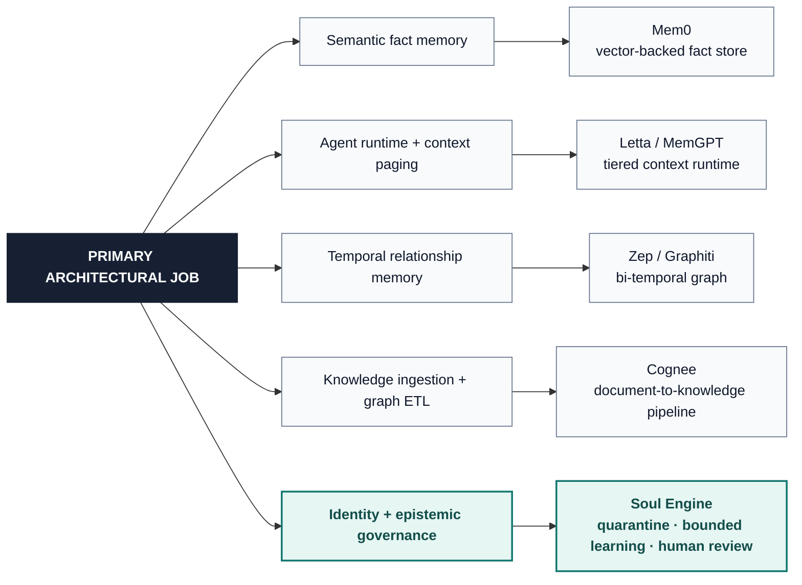

# Industry landscape benchmark: Soul Engine (v1.2.0) vs. alternative agent memory systems

This report provides an architectural comparison between Soul Engine (v1.2.0) and other agent memory frameworks: Mem0, Letta (MemGPT), Zep (Graphiti), and Cognee.

Contradiction checks use a **local token-overlap heuristic**, not a trained NLI model. Unverified claims are quarantined; that is the gaslighting control, not 100% semantic understanding.

---

## 1. Architectural taxonomy

This taxonomy compares each system’s primary architectural job; it is not a quality ranking.

---

## 2. Comparative capability matrix

| Capability / Dimension | **Soul Engine (v1.2.0)** | **Mem0** | **Letta (MemGPT)** | **Zep (Graphiti)** | **Cognee** |
| :--- | :---: | :---: | :---: | :---: | :---: |
| **Primary Paradigm** | Epistemic Identity & Bio-Homeostasis | Semantic Memory SDK | Virtual OS Runtime | Bi-Temporal Graph | Knowledge Base ETL |
| **Epistemic Authority Hierarchy** | **Yes ($\text{verified} > \dots > \text{imagined}$)** | No (Flat facts) | No (Unweighted) | No (Time-based only) | No (Ontological only) |
| **Byzantine Gaslighting Defense** | **Quarantine + token NLI heuristic** | 0% (Blind overwrite) | 0% (Vulnerable) | Partial (Appends new edge) | 0% (Vulnerable) |
| **Bio-Neuromodulation Loop** | **Yes (Dopamine / Cortisol / Serotonin)**| No | No | No | No |
| **Dynamic Trait Clamping** | **Yes (Constitutional $[min, max]$)** | No | No | No | No |
| **Cryptographic Hash Chain** | **Yes (SHA-256 State Ledger)** | No | No | No | No |
| **Protected Identity Isolation** | **Yes (Human Sign-off Guard)** | No | No | No | No |
| **Temporal Fact Handling** | Supersession + Audit Ledger | Version History | Block Rewrites | **Bi-Temporal (`invalid_at`)** | Relational Graph |
| **Retrieval Architecture** | **RRF Hybrid (FTS5 BM25 + Dense Cosine)** | Vector + Neo4j Graph | Archival Tool Search | Graphiti Subgraphs | 12 Search Modes (Cypher, CoT) |
| **Native MCP Protocol** | **Yes (23 Tools, Stdio JSON-RPC)** | REST / Python SDK | REST / CLI | REST / Cloud API | Python SDK / REST |
| **Self-Installation Script** | **Yes (1-Step `install.py`)** | `pip install mem0ai` | `pip install letta` | Managed Cloud / Docker | `pip install cognee` |
| **Zero-Cloud Local Footprint** | **Pure Python + SQLite WAL** | Requires Vector DB / Cloud | Requires PGVector / Server | Requires Graph DB / Cloud | Multi-engine (Kuzu/LanceDB) |

---

## 3. Epistemic integrity and security evaluation

> **Scenario:** an adversary injects the claim “User role changed to Guest.”

| System | Expected storage behavior in this comparison | Security consequence |
| :--- | :--- | :--- |
| Mem0 | Updates semantic memory without Soul’s authority hierarchy | **Unreviewed overwrite risk** |
| Letta | May place the claim in archival memory | **No equivalent promotion gate** |
| Zep / Graphiti | Adds a newer temporal relation | **Temporal recency is not authority** |
| Cognee | Adds a parallel graph relation | **Ambiguity requires downstream resolution** |
| **Soul Engine** | Keeps the lower-rank claim quarantined or contradicted until explicit review commit | **Excluded from default recall** |

Soul’s token-overlap check is a heuristic, not semantic proof. Product behaviors may change; verify them against current upstream versions before treating this table as a security certification.

---

## 4. Architectural differences

| Framework | Primary Use Case | Key Differences in Soul Engine |
| :--- | :--- | :--- |
| **Mem0** | Semantic facts for basic conversational bots | Soul Engine adds epistemic truth verification, trait governance, and bio-homeostatic rewards. |
| **Letta** | Long-running agents managing their own execution paging | Soul Engine operates as a standard MCP server without altering the agent's core runtime loop. |
| **Zep** | Conversational timeline tracking with temporal queries | Soul Engine provides active defense against memory poisoning while remaining entirely local with minimal dependencies. |
| **Cognee** | Enterprise document ingestion and knowledge graph pipelines | Soul Engine focuses on autonomous agent behavioral consistency, emotional equilibrium, and identity protection. |

