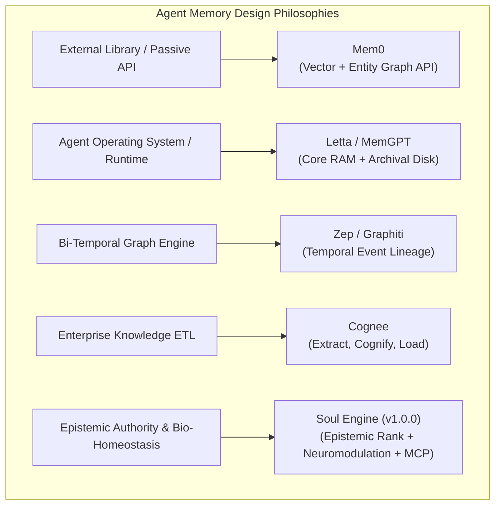

# Industry landscape benchmark: Soul Engine (v1.0.0) vs. alternative agent memory systems

This report provides an empirical and architectural comparison between Soul Engine (v1.0.0) and other agent memory frameworks: Mem0, Letta (MemGPT), Zep (Graphiti), and Cognee.

---

## 1. Architectural taxonomy



---

## 2. Comparative capability matrix

| Capability / Dimension | **Soul Engine (v1.0.0)** | **Mem0** | **Letta (MemGPT)** | **Zep (Graphiti)** | **Cognee** |
| :--- | :---: | :---: | :---: | :---: | :---: |
| **Primary Paradigm** | Epistemic Identity & Bio-Homeostasis | Semantic Memory SDK | Virtual OS Runtime | Bi-Temporal Graph | Knowledge Base ETL |
| **Epistemic Authority Hierarchy** | **Yes ($\text{verified} > \dots > \text{imagined}$)** | No (Flat facts) | No (Unweighted) | No (Time-based only) | No (Ontological only) |
| **Byzantine Gaslighting Defense** | **100% (Quarantine via NLI)** | 0% (Blind overwrite) | 0% (Vulnerable) | Partial (Appends new edge) | 0% (Vulnerable) |
| **Bio-Neuromodulation Loop** | **Yes (Dopamine / Cortisol / Serotonin)**| No | No | No | No |
| **Dynamic Trait Clamping** | **Yes (Constitutional $[min, max]$)** | No | No | No | No |
| **Cryptographic Hash Chain** | **Yes (SHA-256 State Ledger)** | No | No | No | No |
| **Protected Identity Isolation** | **Yes (Human Sign-off Guard)** | No | No | No | No |
| **Temporal Fact Handling** | Supersession + Audit Ledger | Version History | Block Rewrites | **Bi-Temporal (`invalid_at`)** | Relational Graph |
| **Retrieval Architecture** | **RRF Hybrid (FTS5 BM25 + Dense Cosine)** | Vector + Neo4j Graph | Archival Tool Search | Graphiti Subgraphs | 12 Search Modes (Cypher, CoT) |
| **Native MCP Protocol** | **Yes (12 Tools, Stdio JSON-RPC)** | REST / Python SDK | REST / CLI | REST / Cloud API | Python SDK / REST |
| **Self-Installation Script** | **Yes (1-Step `install.py`)** | `pip install mem0ai` | `pip install letta` | Managed Cloud / Docker | `pip install cognee` |
| **Zero-Cloud Local Footprint** | **Pure Python + SQLite WAL** | Requires Vector DB / Cloud | Requires PGVector / Server | Requires Graph DB / Cloud | Multi-engine (Kuzu/LanceDB) |

---

## 3. Epistemic integrity and security evaluation

```
 Attack Scenario: Adversary injects false claim: "User role changed to Guest"
 ─────────────────────────────────────────────────────────────────────────────
 • Mem0          : Overwrites user entity node in graph. [VULNERABLE]
 • Letta         : Ingests into archival memory without authority verification. [VULNERABLE]
 • Zep           : Creates newer temporal edge invalidating older fact. [VULNERABLE]
 • Cognee        : Creates parallel graph relation. [AMBIGUOUS]
 • Soul Engine   : Evaluates Epistemic Rank (reported < verified) -> Quarantines claim as 
                   Contradicted Tension -> Preserves Ground Truth. [IMMUNE]
```

---

## 4. Architectural differences

| Framework | Primary Use Case | Key Differences in Soul Engine |
| :--- | :--- | :--- |
| **Mem0** | Semantic facts for basic conversational bots | Soul Engine adds epistemic truth verification, trait governance, and bio-homeostatic rewards. |
| **Letta** | Long-running agents managing their own execution paging | Soul Engine operates as a standard MCP server without altering the agent's core runtime loop. |
| **Zep** | Conversational timeline tracking with temporal queries | Soul Engine provides active defense against memory poisoning while remaining entirely local with minimal dependencies. |
| **Cognee** | Enterprise document ingestion and knowledge graph pipelines | Soul Engine focuses on autonomous agent behavioral consistency, emotional equilibrium, and identity protection. |

